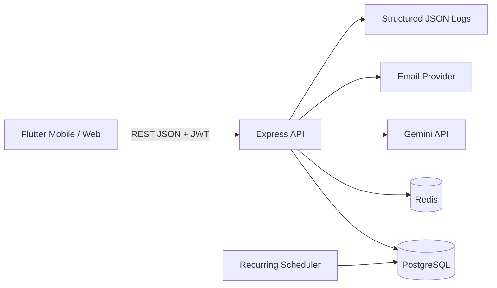

<div align="center">
  

  <h1>NALA — Dana Kelola</h1>

  <p><strong>Kelola uang dengan lebih tenang.</strong></p>
  <p>
    Aplikasi pendamping keuangan mahasiswa untuk mencatat transaksi,
    merencanakan budget, memahami kebiasaan finansial, dan menerima insight
    yang tetap berada di bawah kendali pengguna.
  </p>

  <p>
    
    
    
    
    
    
    
    
  </p>

  <p>
    Prototipe GEMASTIK XIX 2026<br />
    Teknik Informatika 2023 · Fakultas Teknik · Universitas Sam Ratulangi
  </p>
</div>

---

## Tentang NALA

NALA adalah aplikasi pengelolaan keuangan personal yang dirancang dengan fokus
pada mahasiswa usia 18–24 tahun. Produk ini tidak hanya menampilkan angka,
tetapi membantu pengguna membangun kebiasaan sederhana: mencatat secara rutin,
menjaga pengeluaran terhadap budget, dan menyisihkan pemasukan.

Tiga inovasi inti NALA:

1. **Frictionless Financial Capture** — pencatatan manual dan ekstraksi struk
   dengan tahap review sebelum disimpan.
2. **Explainable Financial Habit Score** — skor kebiasaan berbasis rasio simpan,
   kepatuhan budget, dan konsistensi mencatat, lengkap dengan alasan dan tindakan.
3. **Context-Aware Nala Coach** — pendamping berbasis AI dengan konteks minimum,
   redaksi data personal, structured draft, dan konfirmasi sebelum mutasi data.

Financial Habit Score merupakan indikator kebiasaan dalam produk, bukan skor
kredit, diagnosis kondisi finansial, atau instrumen ilmiah tervalidasi.

<div align="center">
  
</div>

## Fitur utama

| Area | Kemampuan |
|---|---|
| Dashboard | Ringkasan saldo, transaksi terbaru, pilihan cepat, dan insight kontekstual |
| Transaksi | Pemasukan/pengeluaran, kategori, merchant, tanggal, filter, pagination, dan idempotency |
| Scan struk | Validasi gambar, OCR/AI extraction, confidence per field, review, dan koreksi |
| Budget | Anggaran bulanan per kategori dan evaluasi pemakaian |
| Tagihan berulang | Jadwal pembayaran dengan perlindungan duplikasi per periode |
| Laporan | Ringkasan pemasukan, pengeluaran, dan perkembangan tiga bulan |
| Habit Score | Skor 0–100, faktor berbobot, alasan perubahan, tindakan, dan histori bulanan |
| Nala Coach | Insight dan draft transaksi yang wajib dikonfirmasi pengguna |
| Akun | Verifikasi email, reset password, session rotation/revoke, biometrik, dan audit trail |
| Privasi | Consent berversi, privacy notice, export JSON, dan penghapusan akun dengan reauthentication |

## Arsitektur



NALA memakai **modular monolith** untuk fase beta/pilot. Bentuk ini menjaga
deployment dan debugging tetap sederhana tanpa menutup kemungkinan pemisahan
service setelah beban serta batas domain benar-benar terukur.

### Stack teknologi

| Lapisan | Teknologi |
|---|---|
| Mobile/Web | Flutter, Dart, Provider, secure storage, local authentication |
| Backend | Node.js, TypeScript, Express |
| Data | PostgreSQL, Prisma ORM, integer rupiah berbasis `BIGINT` |
| Cache/security | Redis rate limiting, JWT access token, rotating refresh session |
| AI/OCR | Gemini dan Google Cloud Vision dengan fallback/review |
| Infrastruktur | Docker Compose, multi-stage production image, GitHub Actions |
| Observability | Request ID, structured JSON access/error events, sensitive-data redaction |

## Menjalankan secara lokal

### Prasyarat

- Docker Engine dengan Docker Compose v2
- Flutter stable dan Chrome untuk menjalankan mobile client sebagai web
- Git

### 1. Clone dan siapkan environment

```bash
git clone git@github.com:Codift05/Nala-CuanManage.git
cd Nala-CuanManage
cp .env.example .env
touch backend/.env
```

`backend/.env` bersifat lokal dan diabaikan Git. Tambahkan `GEMINI_API_KEY` ke
file tersebut hanya bila fitur AI/OCR live diperlukan. Jangan menaruh API key
di source code, README, screenshot, atau commit.

### 2. Jalankan backend dan database

```bash
docker compose up -d --build
docker compose ps
curl http://127.0.0.1:3001/health
```

Development Compose menjalankan PostgreSQL, Redis, migration/schema sync, seed
demo, dan backend. API tersedia di `http://127.0.0.1:3001/api`.

### 3. Jalankan Flutter Web

```bash
cd mobile
flutter pub get
flutter run -d chrome \
  --dart-define=API_BASE_URL=http://127.0.0.1:3001/api
```

Untuk Android Emulator, konfigurasi default memakai
`http://10.0.2.2:3001/api`. Perangkat Android fisik memerlukan alamat IP host
atau `adb reverse tcp:3001 tcp:3001`.

## Akun dan dataset demo

| Field | Nilai development |
|---|---|
| Email | `admin@nala.com` |
| Password | `password123` |
| Isi | 3 wallet, 24 transaksi, 12 budget, dan 3 tagihan berulang |

Jalankan ulang fixture dengan:

```bash
docker compose exec -T backend npm run seed
```

Seed hanya mereset data finansial akun `admin@nala.com`; akun lain tidak
disentuh dan seed ditolak ketika `NODE_ENV=production`. Dataset ini sintetis
untuk demo/screenshot, bukan hasil penelitian atau pengguna nyata. Detail dan
urutan screenshot tersedia pada
[panduan dataset demo](docs/demo/DEMO_DATASET.md).

## Pengujian

### Backend

```bash
cd backend
npm ci
npx prisma generate
npm run typecheck
npm run test:unit
npm run test:contract
npm run test:security
npm run build
```

Integration test menggunakan PostgreSQL dan Redis nyata:

```bash
docker compose exec -T backend npm run test:integration
```

### Flutter

```bash
cd mobile
flutter pub get
flutter analyze --no-fatal-infos --no-fatal-warnings
flutter test
```

CI juga menjalankan integration flow autentikasi, transaksi, review struk, dan
Nala Coach pada runner Linux headless. Matriks dan strategi lengkap tersedia di
[dokumen pengujian](docs/testing/TEST_STRATEGY.md).

## Keamanan dan privasi

- Access token berumur pendek dan refresh token dirotasi serta dapat dicabut.
- Password di-hash dengan bcrypt; token verifikasi/reset disimpan sebagai hash.
- Authorization ownership melindungi wallet, transaksi, budget, recurring bill,
  session, profil, dan export pengguna.
- Mutasi transaksi memakai idempotency key dan constraint database.
- AI hanya menerima konteks minimum; draft tidak dapat tersimpan tanpa konfirmasi.
- Structured logger menyamarkan email, credential, bearer token, dan nomor
  finansial panjang.
- Export tidak membawa password hash, verification token, reset token, atau
  session token.
- Penghapusan akun memerlukan password aktif dan diuji terhadap seluruh relasi.

Baca [Privacy and Data Rights](docs/PRIVACY_DATA_RIGHTS.md),
[Observability Baseline](docs/OBSERVABILITY.md), dan
[Security Test Plan](docs/testing/SECURITY_TEST_PLAN.md).

## Production baseline

Repository menyediakan:

- multi-stage backend image;
- runtime non-root dan read-only;
- migration satu kali melalui `prisma migrate deploy`;
- health check dan fail-fast production configuration;
- backup PostgreSQL ber-checksum serta isolated restore verification;
- production Compose baseline untuk satu host.

Konfigurasi tersebut belum merupakan arsitektur high availability. Domain/TLS,
secret manager, external error tracking, retensi backup, dan signed Android
build harus diselesaikan pada environment staging sebelum pilot. Ikuti
[Production Deployment](docs/PRODUCTION_DEPLOYMENT.md).

## Struktur repository

```text
Nala-CuanManage/
├── backend/                  # Express API, Prisma, scheduler, test, dan seed
│   ├── prisma/               # Schema dan migration PostgreSQL
│   ├── src/                  # Controller, route, middleware, domain utility
│   └── test/                 # Unit, integration, contract, security
├── mobile/                   # Flutter Android/Web client
│   ├── integration_test/     # End-to-end flow terisolasi
│   ├── lib/                  # Screen, service, widget, model, theme
│   └── test/                 # Unit, contract, dan widget test
├── docs/                     # Engineering plan, runbook, test, evaluasi
├── scripts/                  # Backup dan restore verification
├── docker-compose.yml        # Development stack
└── docker-compose.prod.yml   # Single-host staging/production baseline
```

## Dokumentasi

| Dokumen | Fokus |
|---|---|
| [Product Engineering Plan](docs/NALA_PRODUCT_ENGINEERING_PLAN.md) | Roadmap, status, keputusan, metrik, dan bukti aktual |
| [Demo Dataset](docs/demo/DEMO_DATASET.md) | Fixture, akun demo, hasil verifikasi, dan urutan screenshot |
| [Test Strategy](docs/testing/TEST_STRATEGY.md) | Lapisan test, gate CI, dan evidence |
| [Receipt Evaluation](docs/evaluation/RECEIPT_EVALUATION_PROTOCOL.md) | Protokol dataset dan evaluasi OCR |
| [AI Coach Evaluation](docs/evaluation/AI_COACH_EVALUATION_PROTOCOL.md) | Evaluasi live yang terkontrol dan terlacak |
| [Privacy and Data Rights](docs/PRIVACY_DATA_RIGHTS.md) | Consent, export, delete, dan batas production |
| [Production Deployment](docs/PRODUCTION_DEPLOYMENT.md) | Deploy, rollback, backup, dan restore |

## Status pengembangan

NALA masih berada pada fase prototipe menuju beta/pilot. Fitur inti, baseline
keamanan, testing foundation, deployment image, backup/restore, observability,
dan data rights sudah tersedia. Validasi pengguna nyata, performance report,
staging ber-TLS, error tracking production, serta signed Android build masih
menjadi pekerjaan lanjutan dan tidak diklaim selesai.

## Kontribusi

1. Buat branch dari `main`.
2. Jaga perubahan tetap kecil dan sesuai engineering plan.
3. Tambahkan test sesuai risiko perubahan.
4. Jangan commit `.env`, token, API key, data pengguna, atau foto struk nyata.
5. Pastikan backend dan Flutter gate lulus sebelum pull request.

## Tim

NALA dikembangkan untuk GEMASTIK XIX 2026 oleh mahasiswa Program Studi Teknik
Informatika angkatan 2023, Fakultas Teknik, Universitas Sam Ratulangi, Manado.

<table>
  <tr>
    <td align="center">
      <a href="https://github.com/Codift05">
        <br />
        <strong>Miftahuddin S. Arsyad</strong>
      </a><br />
      <sub>Ketua Tim · Lead Software Developer</sub>
    </td>
  </tr>
</table>

Pengembangan NALA dikerjakan bersama tim. Peran di atas mencatat tanggung jawab
utama pada arah teknis, arsitektur, implementasi, integrasi, dan quality gate
perangkat lunak.

---

<div align="center">
  <strong>NALA · Dana Kelola</strong><br />
  <sub>Prototipe akademik untuk pengelolaan keuangan yang lebih terarah.</sub>
</div>
