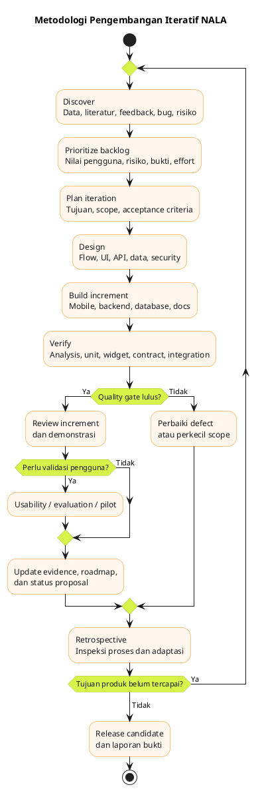
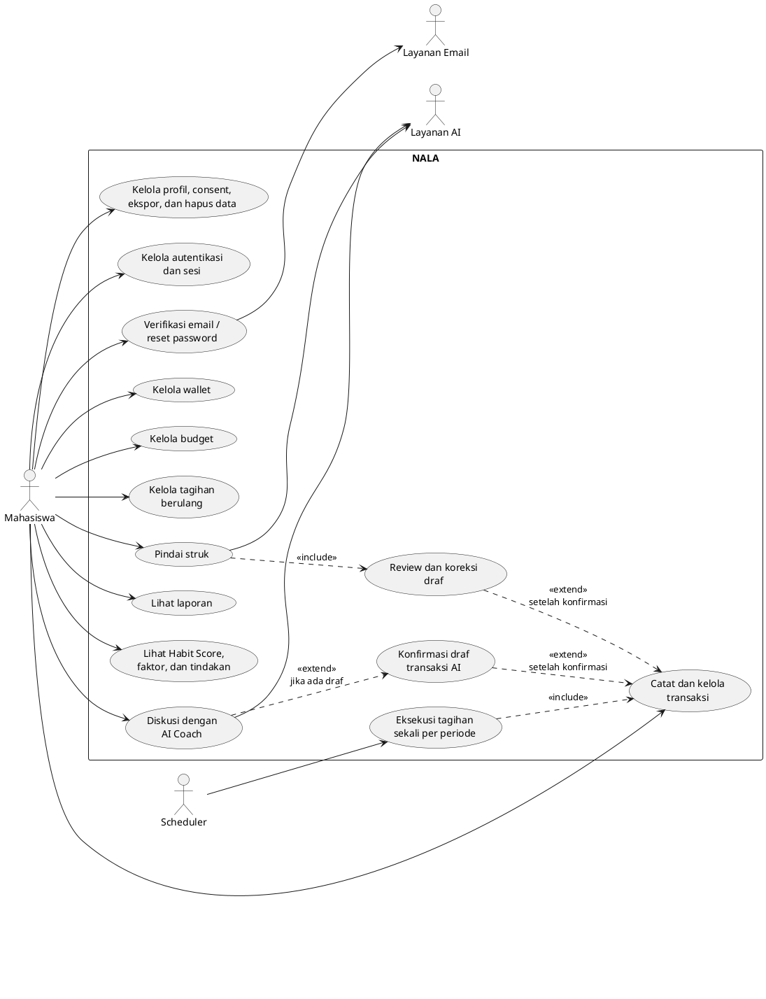
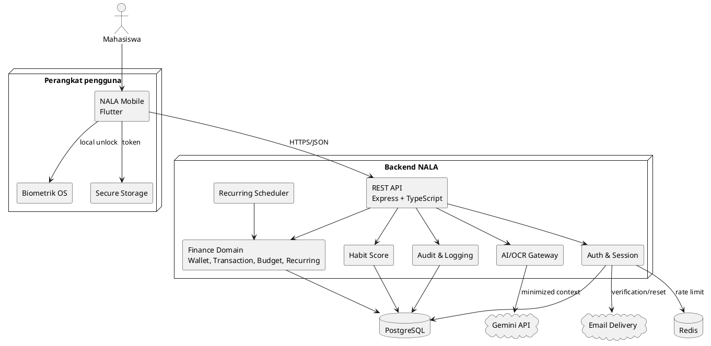
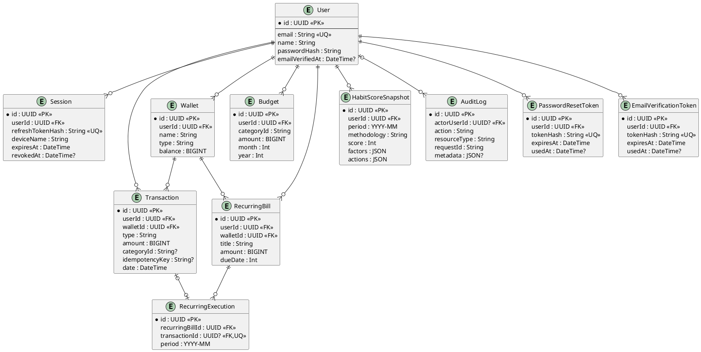
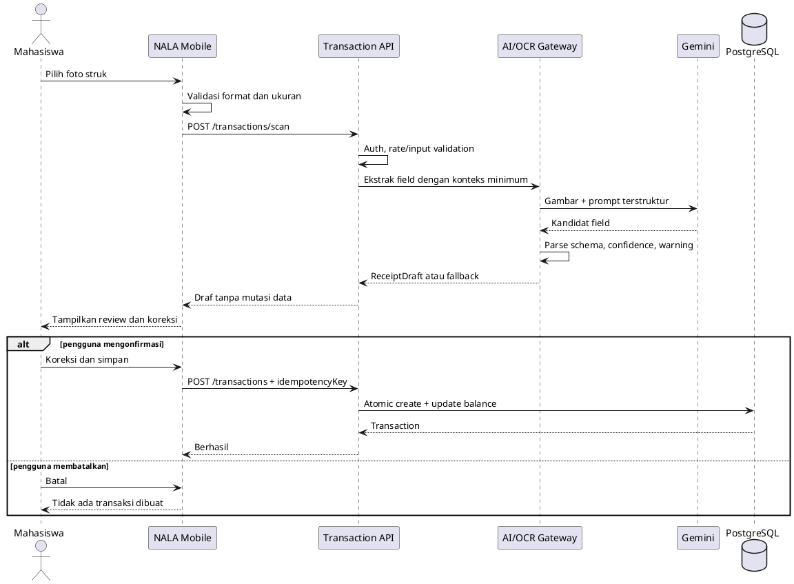
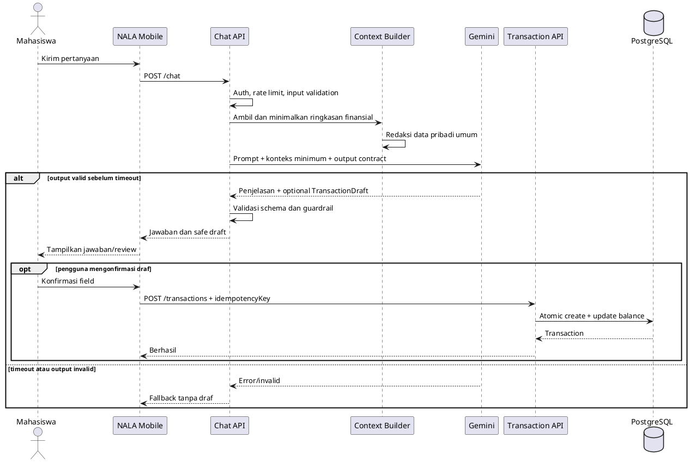

# Proposal Pengembangan Perangkat Lunak GEMASTIK XIX 2026

> Status: draf kerja bertahap — Tahap 1–8 disetujui; Tahap 9 menunggu konfirmasi
>
> Dokumen ini disusun berdasarkan implementasi aktual NALA. Istilah
> `terimplementasi`, `teruji`, dan `tervalidasi` tidak boleh dipakai bergantian.
> Klaim hasil hanya dimasukkan setelah memiliki bukti yang dapat ditelusuri.

## Sampul

**PROPOSAL PENGEMBANGAN PERANGKAT LUNAK GEMASTIK XIX**

### NALA

**Inovasi Aplikasi Pendamping Kebiasaan Finansial Mahasiswa melalui
Frictionless Capture, Explainable Financial Habit Score, dan Kecerdasan
Artifisial Kontekstual**

Cabang Pengembangan Perangkat Lunak


**Tim Pengembang**

1. Miftahuddin S. Arsyad — 230211060009 — Ketua Tim / Software Developer Utama
2. Edward Benedict — 230211060017 — Anggota
3. Kristania Bullu — 230211060016 — Anggota

**Program Studi Teknik Informatika**  
**Jurusan Teknik Elektro**  
**Fakultas Teknik**  
**Universitas Sam Ratulangi**  
**Manado, 2026**

> ID tim dan nama tim resmi diisi setelah data pendaftaran dikonfirmasi.

---

# A. Judul/Nama Perangkat Lunak

## A.1 Identitas Produk

| Atribut | Keterangan |
|---|---|
| Nama perangkat lunak | **NALA** |
| Judul karya | **NALA: Inovasi Aplikasi Pendamping Kebiasaan Finansial Mahasiswa melalui Frictionless Capture, Explainable Financial Habit Score, dan Kecerdasan Artifisial Kontekstual** |
| Deskripsi singkat | Pendamping kebiasaan finansial yang membantu mahasiswa mencatat, memahami, dan menindaklanjuti kondisi keuangannya melalui alur pencatatan minim friksi, skor yang dapat dijelaskan, dan pendamping AI yang terkendali pengguna. |
| Tagline produk | **Atur uang nggak perlu ribet. Bareng Nala aja.** |
| Target pengguna utama | Mahasiswa aktif berusia 18–24 tahun yang mengelola uang tunai, rekening, atau dompet digital dan kesulitan menjaga kebiasaan pencatatan serta penganggaran. |
| Platform kompetisi | Aplikasi mobile Android berbasis Flutter dengan backend REST API |
| Status | Prototipe fungsional / beta internal |
| Kategori | Financial wellness dan personal financial management |

## A.2 Pernyataan Nilai

NALA tidak diposisikan sebagai aplikasi perbankan, alat pembayaran, aplikasi
investasi, atau penasihat keuangan berlisensi. NALA merupakan **pendamping
kebiasaan finansial mahasiswa** yang menutup jarak antara mengetahui kondisi
keuangan dan melakukan tindakan perbaikan yang aman.

Alur nilai NALA dirumuskan sebagai berikut:

> **Tangkap transaksi dengan lebih ringan → pahami kebiasaan secara transparan
> → lakukan perbaikan dengan pendampingan kontekstual dan kendali pengguna.**

## A.3 Kebaruan yang Ditonjolkan

Kebaruan NALA bukan terletak pada fitur pencatatan keuangan secara terpisah,
melainkan pada integrasi tiga mekanisme yang saling berhubungan:

1. **Pencatatan minim friksi (Frictionless Capture).** Pengguna dapat
   membuat catatan melalui input cepat, pemindaian struk dengan tahap koreksi,
   impor bukti transaksi, atau percakapan dengan Nala. Semua hasil otomatisasi
   tetap berbentuk draf yang dapat diperiksa sebelum disimpan.
2. **Explainable Financial Habit Score.** Skor kebiasaan dihitung dari rasio
   simpan, kepatuhan anggaran, dan konsistensi pencatatan. NALA menampilkan
   faktor pembentuk, alasan, tindakan perbaikan, dan histori bulanan; skor bukan
   penilaian kredit maupun diagnosis kesehatan finansial.
3. **AI kontekstual dengan human-in-the-loop.** AI menerima konteks finansial
   minimum yang diperlukan, menyamarkan data pribadi umum, dan tidak dapat
   mengubah catatan keuangan tanpa review serta konfirmasi eksplisit pengguna.

Kombinasi tersebut menggeser fungsi aplikasi dari sekadar **buku kas digital**
menjadi siklus perubahan kebiasaan yang tetap transparan dan dikendalikan
pengguna. Pernyataan kebaruan ini akan diuji melalui perbandingan produk,
pengujian usability, evaluasi ekstraksi struk, serta pilot pengguna; bukan
dinyatakan sebagai keunggulan absolut tanpa bukti.

## A.4 Alasan Pemilihan Judul

| Unsur judul | Fungsi strategis |
|---|---|
| Inovasi aplikasi | Menegaskan bahwa karya merupakan perangkat lunak fungsional dengan integrasi mekanisme baru, bukan hanya gagasan konseptual. |
| Pendamping kebiasaan finansial | Mempersempit masalah dari “semua kebutuhan keuangan” menjadi pembentukan perilaku yang dapat didukung perangkat lunak. |
| Mahasiswa | Menetapkan segmen early adopter yang jelas dan dapat dijangkau untuk riset serta pilot. |
| Frictionless Capture | Menjawab hambatan pencatatan yang mudah ditinggalkan melalui beberapa jalur input dengan tahap review. |
| Explainable Financial Habit Score | Menunjukkan keluaran yang transparan, dapat ditelusuri, dan berbeda dari skor kredit. |
| Kecerdasan Artifisial Kontekstual | Menunjukkan pendampingan yang memakai konteks minimum dan tetap menempatkan review serta keputusan pada pengguna. |

Judul tersebut berjumlah 18 kata. Judul menampilkan bentuk karya, pengguna, dan
tiga inovasi tanpa menjanjikan peningkatan perilaku yang belum dibuktikan oleh
pilot. Istilah teknis pada judul diperlakukan sebagai nama mekanisme yang akan
didefinisikan, diimplementasikan, dan diuji dalam proposal.

---

# B. Latar Belakang Ide Perangkat Lunak

## B.1 Transformasi Keuangan Digital dan Kesenjangan Literasi–Inklusi

Transformasi sistem pembayaran memperluas cara masyarakat Indonesia mengakses
dan menggunakan layanan keuangan. Bank Indonesia mencatat 14,26 miliar
transaksi pembayaran digital pada triwulan IV 2025, tumbuh 39,21% dibandingkan
periode yang sama tahun sebelumnya. Pada periode tersebut, transaksi QRIS
tumbuh 139,99% dengan 59,53 juta pengguna dan 42,75 juta merchant.[4] Data ini
menunjukkan bahwa aktivitas keuangan sehari-hari semakin mudah dilakukan secara
digital. Namun, kemudahan bertransaksi tidak otomatis menghasilkan kemampuan
mengelola uang secara terencana.

Survei Nasional Literasi dan Inklusi Keuangan (SNLIK) 2025 oleh Otoritas Jasa
Keuangan dan Badan Pusat Statistik mencatat indeks literasi keuangan nasional
sebesar 66,46%, sedangkan indeks inklusi keuangan mencapai 80,51%.[2] Selisih
14,05 poin persentase tersebut menunjukkan bahwa penggunaan produk dan layanan
keuangan berkembang lebih luas daripada pemahaman masyarakat dalam memilih,
menilai risiko, dan mengelolanya. Karena itu, persoalan yang dihadapi Indonesia
tidak tepat digambarkan sekadar sebagai kurangnya akses. Tantangannya adalah
mengubah akses dan pengetahuan menjadi perilaku finansial yang dapat diterapkan
secara konsisten.

Kesenjangan tersebut semakin relevan pada target pengguna NALA. Berdasarkan
aktivitas sehari-hari, SNLIK 2025 mencatat indeks literasi kelompok
pelajar/mahasiswa sebesar 61,76%, sedangkan indeks inklusinya mencapai 84,42%.
Artinya, terdapat kesenjangan 22,66 poin persentase pada kelompok yang menjadi
target produk.[2] Berdasarkan kelompok umur, penduduk berusia 18–25 tahun juga
memiliki inklusi 89,96%, lebih tinggi daripada literasinya yang sebesar 73,22%.[2]
Angka tersebut tidak berarti seluruh mahasiswa memiliki perilaku keuangan yang
buruk, tetapi menunjukkan kebutuhan akan dukungan praktis agar akses layanan
keuangan diikuti pemahaman dan pengelolaan yang bertanggung jawab.

## B.2 Kesenjangan antara Pengetahuan dan Praktik Finansial Mahasiswa

Mahasiswa berada pada fase transisi menuju kemandirian. Pada fase ini, sebagian
mahasiswa mulai mengatur uang saku, biaya tempat tinggal, kebutuhan akademik,
transportasi, konsumsi, tabungan, serta pembayaran digital secara mandiri.
Keterbatasan pendapatan dan perubahan kebutuhan membuat keputusan kecil yang
berulang—mencatat pengeluaran, menetapkan anggaran, dan mengevaluasi sisa
dana—lebih relevan daripada pemahaman konsep keuangan secara abstrak.

Penelitian Cahyono *et al.* terhadap 20 mahasiswa Indonesia menemukan bahwa
akses terhadap informasi keuangan belum selalu diikuti penerapan yang memadai.
Perilaku peserta juga dipengaruhi oleh pengendalian diri, tekanan sosial, *fear
of missing out*, dan media sosial.[3] Temuan ini menunjukkan bahwa intervensi
yang hanya menyediakan materi edukasi belum tentu menjangkau momen ketika
mahasiswa benar-benar mengambil keputusan.

Tinjauan sistematis Sarlawa dan Ali terhadap lebih dari 80 penelitian empiris
menempatkan perilaku sebagai jalur mediasi penting antara literasi dan
kesejahteraan finansial: pengetahuan dan keterampilan perlu diwujudkan dalam
praktik budgeting, menabung, serta pengelolaan kewajiban.[6] Temuan Yektiningtyas
*et al.* pada mahasiswa Universitas Dian Nuswantoro juga menunjukkan bahwa
penyusunan anggaran berpengaruh positif dan signifikan terhadap perilaku
menabung, sementara pencatatan pengeluaran secara terpisah tidak menunjukkan
pengaruh signifikan.[5] Dengan demikian, pencatatan diperlukan sebagai sumber
data, tetapi nilainya baru meningkat ketika data tersebut membantu pengguna
memahami pola dan menentukan tindakan.

## B.3 Masalah Desain yang Hendak Diselesaikan

Berdasarkan data sekunder dan audit awal terhadap alur pengelolaan keuangan,
NALA merumuskan tiga hambatan desain yang saling berkaitan. Rumusan ini masih
akan diverifikasi melalui survei kebutuhan dan wawancara calon pengguna.

1. **Friksi pencatatan.** Pencatatan manual yang membutuhkan banyak langkah
   mudah tertunda. Ketika transaksi tidak tercatat, ringkasan, anggaran, dan
   evaluasi berikutnya dibangun dari data yang tidak lengkap.
2. **Kesenjangan interpretasi.** Daftar transaksi dan grafik menjelaskan apa
   yang telah terjadi, tetapi belum tentu menjelaskan faktor kebiasaan yang
   perlu diperbaiki atau tindakan kecil yang dapat dilakukan berikutnya.
3. **Risiko pendampingan otomatis.** Saran berbasis kecerdasan artifisial dapat
   terasa personal, tetapi keluaran yang tidak transparan atau perubahan data
   tanpa konfirmasi berisiko menimbulkan ketergantungan, salah tafsir, dan
   hilangnya kendali pengguna.

Ketiga masalah tersebut membentuk hubungan berantai. Input yang berat
menghasilkan data yang jarang atau tidak lengkap; data yang tidak diterjemahkan
menjadi alasan dan tindakan hanya menjadi arsip; sedangkan rekomendasi otomatis
yang tidak transparan dapat menciptakan risiko baru. Karena itu, solusi NALA
dirancang sebagai satu siklus, bukan kumpulan fitur yang berdiri sendiri.

## B.4 Keterbatasan Pendekatan Solusi yang Umum

Secara umum, solusi pengelolaan keuangan personal dapat dikelompokkan menjadi
tiga pendekatan. Pertama, aplikasi buku kas dan budgeting menekankan pencatatan,
kategori, serta visualisasi, tetapi kualitas hasilnya sangat bergantung pada
konsistensi input pengguna. Kedua, histori pada aplikasi bank atau dompet
digital mencatat transaksi pada layanan masing-masing, tetapi belum selalu
merepresentasikan uang tunai dan media keuangan lain sebagai satu kebiasaan.
Ketiga, asisten berbasis AI dapat memberi jawaban dengan cepat, tetapi jawaban
yang tidak memiliki konteks data, alasan yang dapat diperiksa, atau mekanisme
konfirmasi tidak cukup aman untuk mengubah catatan finansial.

Penelitian Ioannou *et al.* melalui eksperimen terhadap 453 partisipan
menunjukkan bahwa kualitas informasi, kegunaan, kepercayaan, tingkat
explainability, dan konteks risiko memengaruhi bagaimana pengguna mengadopsi
rekomendasi finansial berbasis AI.[7] Temuan tersebut memperkuat kebutuhan
untuk tidak menjadikan AI sebagai pengambil keputusan otonom. NALA menggunakan
AI sebagai pendamping yang menghasilkan penjelasan atau draf, sedangkan
pengguna tetap menilai dan mengonfirmasi tindakan.

Perbandingan terverifikasi terhadap aplikasi sejenis akan disajikan pada Bagian
F. Bagian ini tidak menyatakan NALA sebagai satu-satunya aplikasi dengan fitur
tertentu sebelum dokumentasi resmi setiap pembanding diperiksa.

## B.5 Gagasan Solusi NALA

NALA dikembangkan sebagai aplikasi pendamping kebiasaan finansial mahasiswa
dengan siklus **Capture–Understand–Act**:

1. **Capture:** *Frictionless Capture* menyediakan input cepat, pemindaian
   struk dengan review, impor bukti transaksi, dan draf dari percakapan untuk
   mengurangi langkah pencatatan tanpa menghilangkan validasi pengguna.
2. **Understand:** *Explainable Financial Habit Score* menerjemahkan transaksi
   dan anggaran menjadi tiga komponen yang dapat ditelusuri—rasio simpan,
   kepatuhan anggaran, dan konsistensi pencatatan—beserta alasan, tindakan, dan
   histori. Skor ini bukan skor kredit atau diagnosis kesehatan finansial.
3. **Act:** Kecerdasan Artifisial Kontekstual memakai ringkasan data minimum
   untuk memberi penjelasan atau menyusun draf tindakan. AI tidak menyimpan
   transaksi tanpa review dan konfirmasi eksplisit pengguna.

Integrasi ketiganya merupakan kebaruan utama NALA: mengurangi hambatan untuk
mendapatkan data, membuat hasilnya dapat dipahami, lalu menghubungkannya dengan
tindakan yang tetap berada di bawah kendali manusia. Fitur multi-wallet,
budget, tagihan berulang, laporan, dan visualisasi berfungsi sebagai pendukung
siklus tersebut.

## B.6 Urgensi dan Relevansi Pengembangan

Pengembangan NALA relevan karena pertumbuhan transaksi digital berlangsung
lebih cepat daripada kemampuan praktis sebagian pelajar dan mahasiswa dalam
mengelola layanan keuangan. Tanpa dukungan kebiasaan, kemudahan transaksi dapat
berakhir sebagai histori yang tersebar dan baru dievaluasi setelah dana telah
digunakan. Pendekatan mobile dipilih karena dapat hadir dekat dengan momen
pencatatan dan refleksi, sedangkan target mahasiswa dipilih agar masalah,
bahasa, skenario penggunaan, dan evaluasi dapat difokuskan.

NALA juga selaras dengan fokus cabang Pengembangan Perangkat Lunak GEMASTIK XIX,
yaitu perangkat lunak operasional yang menyelesaikan masalah Indonesia dan
membuktikan dampaknya dengan data.[1] Oleh sebab itu, keberhasilan NALA tidak
akan dinilai hanya dari banyaknya fitur, tetapi dari kemampuan alur inti untuk
digunakan, kualitas pengujian teknis, kemudahan penggunaan, dan perubahan
indikator perilaku yang diukur melalui pilot.

## B.7 Rumusan Masalah

Berdasarkan uraian tersebut, pengembangan NALA diarahkan untuk menjawab
pertanyaan berikut:

1. Bagaimana mengurangi friksi pencatatan transaksi tanpa mengurangi akurasi
   dan kendali pengguna terhadap data finansialnya?
2. Bagaimana menerjemahkan data transaksi dan anggaran menjadi indikator
   kebiasaan yang transparan, dapat ditelusuri, dan menghasilkan tindakan?
3. Bagaimana memanfaatkan AI kontekstual untuk mendampingi mahasiswa tanpa
   mengirim data berlebihan atau melakukan perubahan finansial secara otonom?
4. Sejauh mana alur NALA dapat meningkatkan keberhasilan tugas, memperpendek
   waktu pencatatan, dan mendukung konsistensi pengelolaan finansial mahasiswa?

Pertanyaan keempat merupakan pertanyaan evaluasi, bukan klaim hasil. Jawabannya
akan diperoleh melalui usability testing dan pilot pengguna aktual.

## B.8 Kebutuhan Bukti Primer

Data nasional dan literatur menjelaskan konteks, tetapi tidak menggantikan
validasi terhadap calon pengguna NALA. Sebelum proposal final, tim perlu
mengumpulkan bukti primer berikut secara beretika:

| Bukti | Tujuan | Status saat ini |
|---|---|---|
| Survei kebutuhan mahasiswa | Mengukur media keuangan, kebiasaan mencatat, budgeting, dan hambatan utama | Belum dilaksanakan |
| Wawancara singkat | Memahami penyebab friksi dan bahasa pengguna | Belum dilaksanakan |
| Usability test terstruktur | Mengukur task success, waktu, error, bantuan, dan SUS | Protokol tersedia; peserta belum diuji |
| Evaluasi pemindaian struk | Mengukur akurasi per field, review recall, correction rate, dan latency | Baseline sintetis tersedia; dataset nyata berizin belum diuji |
| Pilot kebiasaan finansial | Mengukur retensi pencatatan, kepatuhan budget, dan perubahan komponen skor | Belum dilaksanakan |

Pemisahan status tersebut mencegah target atau hasil dataset sintetis ditulis
sebagai dampak pengguna nyata.

# C. Tujuan dan Manfaat Dikembangkannya Perangkat Lunak

## C.1 Tujuan Umum

Mengembangkan NALA sebagai aplikasi pendamping kebiasaan finansial yang
membantu mahasiswa menangkap transaksi dengan lebih ringan, memahami faktor
kebiasaan secara transparan, dan menindaklanjuti kondisi keuangan melalui
pendampingan kontekstual yang tetap berada di bawah kendali pengguna.

Tujuan tersebut merespons kesenjangan antara inklusi dan literasi keuangan
kelompok pelajar/mahasiswa serta temuan bahwa pengetahuan perlu diterjemahkan
menjadi praktik budgeting, menabung, dan pengelolaan finansial sehari-hari.[2],
[3], [5], [6]

## C.2 Tujuan Khusus

1. **Mengurangi friksi pencatatan transaksi** melalui input manual yang
   ringkas, pemindaian struk dengan tahap koreksi, impor bukti transaksi, dan
   draf transaksi dari percakapan.
2. **Menyatukan gambaran keuangan personal** dari uang tunai, rekening, dan
   dompet digital yang dimasukkan pengguna ke dalam multi-wallet, transaksi,
   anggaran, tagihan berulang, dan laporan periodik.
3. **Menghasilkan indikator kebiasaan yang dapat dijelaskan** melalui
   *Explainable Financial Habit Score* yang menampilkan komponen rasio simpan,
   kepatuhan anggaran, konsistensi pencatatan, alasan perubahan, tindakan yang
   disarankan, dan histori bulanan.
4. **Menyediakan pendampingan AI yang kontekstual dan aman** dengan minimisasi
   data, penyamaran data pribadi umum, keluaran berupa saran atau draf, serta
   review dan konfirmasi sebelum perubahan data finansial disimpan.
5. **Menjaga integritas dan privasi data finansial** melalui autentikasi,
   otorisasi kepemilikan, penyimpanan token yang aman, nominal rupiah berbasis
   integer, idempotensi transaksi, audit trail, serta hak ekspor dan
   penghapusan data.
6. **Menguji kelayakan solusi secara terukur** menggunakan unit, widget,
   contract, integration, security, usability, receipt evaluation,
   performance test, dan pilot pengguna.
7. **Menghasilkan bukti pengembangan yang dapat ditelusuri** sehingga setiap
   klaim inovasi, kualitas, usability, dan dampak pada proposal dapat
   dihubungkan dengan implementasi, hasil pengujian, atau data pengguna aktual.

## C.3 Manfaat yang Diharapkan

| Penerima manfaat | Manfaat langsung | Batas klaim |
|---|---|---|
| Mahasiswa | Memperoleh satu alur untuk mencatat, menyusun anggaran, memahami faktor kebiasaan, dan meninjau tindakan yang relevan. | NALA tidak menjamin peningkatan kondisi finansial dan bukan penasihat keuangan. |
| Mahasiswa dengan beberapa media keuangan | Dapat menyusun gambaran uang tunai, rekening, dan dompet digital berdasarkan data yang mereka masukkan. | NALA belum terhubung langsung dengan sistem perbankan atau pembayaran. |
| Pengguna pemindaian struk | Mengurangi pengetikan ulang melalui hasil ekstraksi yang dapat diperiksa dan dikoreksi. | Akurasi pada struk nyata harus dibuktikan; AI tidak dianggap selalu benar. |
| Pengguna AI Coach | Mendapatkan penjelasan kontekstual serta draf tindakan tanpa menyerahkan keputusan akhir kepada AI. | Saran bersifat edukatif, bukan rekomendasi investasi atau nasihat profesional. |
| Perguruan tinggi dan peneliti | Mendapatkan prototipe serta kerangka evaluasi untuk mempelajari usability dan kebiasaan pengelolaan finansial mahasiswa. | Data studi harus berizin, dipseudonimkan, dan tidak boleh dipakai di luar tujuan persetujuan. |
| Ekosistem edukasi keuangan | Mendapatkan contoh penerapan yang menghubungkan edukasi dengan pencatatan, refleksi, dan tindakan sehari-hari. | Dampak sosial baru dapat dinyatakan setelah pilot dengan metode dan sampel yang transparan. |

## C.4 Teori Perubahan NALA

Hubungan antara teknologi dan dampak NALA dirumuskan sebagai teori perubahan
berikut:

| Tahap | Rumusan NALA | Contoh bukti |
|---|---|---|
| Masukan | Aplikasi mobile, backend, data yang dimasukkan pengguna, model AI, formula Habit Score, dan protokol evaluasi | Repositori, arsitektur, data flow, instrumen penelitian |
| Aktivitas | Mencatat atau mengoreksi transaksi, menyusun budget, membaca faktor skor, dan mereview saran/draf AI | Event tugas, log aman, hasil usability |
| Keluaran | Transaksi lebih lengkap, budget tercatat, komponen skor terlihat, dan tindakan dikonfirmasi pengguna | Data aplikasi dan hasil pengujian alur |
| Outcome awal | Pengguna lebih mampu mengenali pengeluaran terbesar, status budget, dan tindakan yang dapat dilakukan | Kuesioner sebelum–sesudah dan task comprehension |
| Outcome perilaku | Konsistensi pencatatan dan kepatuhan terhadap budget berubah selama periode pilot | Cohort dan perbandingan baseline–akhir |
| Dampak yang diharapkan | Mahasiswa lebih mandiri dan reflektif dalam mengelola keuangan personal | Studi longitudinal lanjutan; belum diklaim sebagai hasil kompetisi |

Teori perubahan ini memiliki tiga asumsi yang perlu diuji: (1) pengguna bersedia
mencatat atau mengoreksi data, (2) penjelasan dapat dipahami tanpa menambah
beban kognitif, dan (3) tindakan yang disarankan dianggap relevan serta dapat
dilakukan. Karena itu, jumlah fitur tidak dipakai sebagai pengganti bukti
usability atau perubahan perilaku.

## C.5 Indikator Keberhasilan Pengembangan

Angka pada tabel berikut merupakan **target evaluasi awal**, bukan hasil
aktual. Target dapat direvisi setelah baseline pengguna nyata tersedia, dengan
alasan perubahan dicatat secara transparan.

### C.5.1 Usability dan adopsi alur inti

| Indikator | Target awal | Metode pembuktian |
|---|---:|---|
| Keberhasilan tugas pencatatan manual | ≥90% | Usability test terstruktur |
| Keberhasilan tugas scan dan koreksi struk | ≥85% | Usability test terstruktur |
| System Usability Scale (SUS) | ≥75 | Kuesioner SUS setelah tugas |
| Median waktu input manual | ≤35 detik | Timestamp mulai–selesai |
| Median waktu scan sampai halaman review | ≤15 detik | Timestamp mulai–review |
| Retensi peserta pilot hari ke-14 | ≥50% | Analisis cohort pilot |

### C.5.2 Kualitas pemindaian struk

| Indikator | Target awal | Metode pembuktian |
|---|---:|---|
| Akurasi nominal | ≥90% | Perbandingan field terhadap ground truth |
| Akurasi merchant | ≥85% | Perbandingan field terhadap ground truth |
| Akurasi tanggal | ≥80% | Perbandingan field terhadap ground truth |
| Akurasi kategori | ≥75% | Perbandingan field terhadap ground truth |
| Latensi p95 | ≤10 detik | Hasil runner evaluasi |
| Kesalahan yang berhasil ditandai untuk review | Diukur tanpa target awal | Review recall |

Baseline sintetis telah tersedia, tetapi tidak digunakan sebagai bukti akurasi
pada struk dunia nyata. Klaim final hanya memakai dataset nyata yang diperoleh
dengan izin dan memiliki ground truth.

### C.5.3 Outcome pilot

Outcome berikut diukur sebagai perubahan dari baseline, tanpa menetapkan angka
kenaikan sebelum distribusi awal diketahui:

1. kemampuan peserta mengenali kategori pengeluaran terbesar;
2. konsistensi pencatatan per minggu;
3. kepatuhan terhadap budget yang dibuat peserta;
4. perubahan setiap komponen *Financial Habit Score*;
5. proporsi saran Nala yang dipahami dan dianggap dapat dilakukan; serta
6. proporsi draf AI yang dikoreksi atau dibatalkan sebelum penyimpanan.

Hasil akan dilaporkan bersama jumlah peserta, karakteristik sampel, periode,
instrumen, data tidak lengkap, dan keterbatasan penelitian. Perubahan indikator
tidak langsung ditafsirkan sebagai hubungan sebab-akibat tanpa desain evaluasi
yang mendukung.

## C.6 Potensi Keberlanjutan

| Dimensi | Strategi keberlanjutan |
|---|---|
| Produk | Mempertahankan fokus pada tiga inovasi inti dan mengembangkan fitur berdasarkan hasil pilot, bukan tren atau jumlah fitur. |
| Pengguna | Menggunakan bahasa sederhana, penjelasan skor, tindakan kecil, serta kontrol penuh atas koreksi dan konfirmasi. |
| Teknologi | Memakai Flutter dan backend modular monolith agar dapat dipelihara tim kecil; peningkatan arsitektur dilakukan setelah ada kebutuhan skala terukur. |
| Operasional | Menyediakan automated test, migration terkontrol, backup–restore, structured logging, dan dokumentasi deployment sebelum beta publik. |
| Finansial | Menekan biaya awal melalui layanan yang dapat dikonfigurasi dan penggunaan AI hanya pada alur bernilai; model pembiayaan belum ditetapkan sebelum biaya serta kebutuhan pengguna diukur. |
| Etika dan privasi | Meminimalkan data yang dikirim ke AI, meminta consent, menyediakan ekspor/penghapusan data, dan mempertahankan human-in-the-loop pada mutasi finansial. |
| Replikasi | Menyediakan metodologi pengujian dan bukti yang dapat direplikasi tanpa membuka data finansial personal peserta. |

Keberlanjutan tidak diartikan sebagai janji pertumbuhan pengguna atau pendapatan
yang belum diuji. Pada tahap kompetisi, sustainability dibuktikan melalui scope
yang dapat dipelihara, biaya yang dapat diukur, perlindungan pengguna, dan
roadmap berbasis evidence.

## C.7 Pemisahan Target dan Hasil

Untuk menjaga validitas proposal, NALA menggunakan tiga label pelaporan:

- **Terimplementasi:** alur tersedia pada codebase dan dapat didemonstrasikan.
- **Teruji:** alur memiliki hasil pengujian yang dapat diulang.
- **Tervalidasi:** manfaat atau outcome telah diuji bersama pengguna aktual.

Saat draf ini disusun, sejumlah alur inti telah terimplementasi dan teruji,
tetapi manfaat terhadap perilaku mahasiswa belum boleh disebut tervalidasi
sebelum usability testing dan pilot selesai.

# D. Batasan Perangkat Lunak yang Dikembangkan

Penetapan batasan menjaga NALA tetap dapat direalisasikan, diuji, dan
dipertanggungjawabkan oleh tim. Batasan bukan sekadar daftar fitur yang belum
tersedia, melainkan keputusan scope berdasarkan target pengguna, waktu
kompetisi, risiko data finansial, keterbatasan AI, dan kesiapan operasional.

## D.1 Ruang Lingkup Versi Kompetisi

Versi kompetisi berfokus pada pengelolaan kebiasaan finansial personal untuk
mahasiswa melalui aplikasi Android. Ruang lingkup utamanya meliputi:

1. registrasi, verifikasi email, login, reset password, dan manajemen sesi;
2. pengelolaan beberapa wallet yang merepresentasikan uang tunai, rekening,
   atau dompet digital;
3. pencatatan pemasukan dan pengeluaran dengan kategori, tanggal, dan catatan;
4. penyusunan budget bulanan dan pemantauan realisasi;
5. pencatatan tagihan berulang dengan perlindungan transaksi duplikat;
6. pemindaian atau impor gambar struk, ekstraksi field, review, dan koreksi;
7. *Explainable Financial Habit Score* beserta faktor, tindakan, dan histori;
8. AI Coach kontekstual yang menghasilkan penjelasan atau draf transaksi;
9. laporan visual aktivitas finansial; serta
10. profil, biometrik lokal, consent, ekspor data, dan penghapusan akun.

NALA hanya mengolah data yang dibuat atau diberikan secara sadar oleh pengguna.
Label wallet tidak berarti NALA terhubung dengan penyedia rekening atau dompet
digital tersebut.

## D.2 Fitur dan Domain di Luar Ruang Lingkup

| Di luar scope kompetisi | Alasan |
|---|---|
| Pembayaran, transfer uang, QRIS, dan top-up | NALA bukan penyedia jasa pembayaran dan tidak memindahkan dana. |
| Integrasi langsung bank/e-wallet atau open banking | Membutuhkan kerja sama, keamanan, tata kelola, dan kepatuhan yang tidak layak disimulasikan sebagai fitur kompetisi. |
| Investasi, rekomendasi produk, pinjaman, atau pengelolaan portofolio | Berada di luar tujuan pembentukan kebiasaan dan dapat menimbulkan interpretasi sebagai nasihat keuangan. |
| Credit scoring atau penilaian kelayakan kredit | Financial Habit Score hanya merefleksikan kebiasaan dari data internal pengguna. |
| Shared budget dan akun keluarga | Memerlukan model izin, konflik perubahan, dan privasi multi-pengguna yang berbeda. |
| Pembacaan SMS otomatis | Dihapus dari build beta karena sensitivitas permission, privasi, dan distribusi aplikasi. |
| Mode offline dan sinkronisasi antrean | Belum tersedia mekanisme queue, conflict resolution, dan retry yang menjamin integritas saldo. |
| Laporan PDF dan push notification | Dipertahankan sebagai roadmap dan tidak disebut terimplementasi sebelum alurnya tersedia serta diuji. |
| Native Android/iOS terpisah | Flutter dipertahankan sebagai satu codebase; Android menjadi platform prototipe utama. |
| Microservices, Kafka, dan Kubernetes | Modular monolith lebih proporsional untuk skala beta dan kapasitas tim saat ini. |

## D.3 Batasan Fungsional

1. NALA mengandalkan kedisiplinan pengguna untuk memasukkan atau mengoreksi
   data; saldo pada aplikasi bukan saldo resmi penyedia layanan keuangan.
2. Perubahan transaksi memengaruhi saldo internal NALA, tetapi tidak mengubah
   saldo rekening, uang elektronik, atau uang tunai sebenarnya.
3. Budget merupakan batas perencanaan yang dibuat pengguna, bukan pemblokiran
   transaksi atau kontrol pengeluaran pada penyedia pembayaran.
4. Tagihan berulang membuat catatan transaksi internal sesuai konfigurasi dan
   tidak melakukan pembayaran otomatis.
5. Laporan dan insight hanya mencerminkan periode serta data yang tersedia.
   Data yang tidak lengkap dapat menghasilkan ringkasan yang tidak lengkap.
6. Versi kompetisi berfokus pada rupiah dan antarmuka berbahasa Indonesia.

## D.4 Batasan Financial Habit Score

*Explainable Financial Habit Score* dibatasi sebagai indikator kebiasaan
berdasarkan tiga komponen: rasio simpan, kepatuhan budget, dan konsistensi
pencatatan. Konsekuensinya:

1. skor tidak mengukur kekayaan, kesehatan mental, solvabilitas, risiko gagal
   bayar, atau kelayakan kredit;
2. skor tidak membandingkan pengguna dengan pengguna lain;
3. komponen yang tidak memiliki data tidak diberi nilai buatan dan bobot hanya
   dinormalisasi dari komponen yang tersedia;
4. tren dapat kosong ketika histori belum cukup;
5. bobot formula merupakan hipotesis desain yang harus divalidasi melalui
   pilot, bukan standar ilmiah atau regulasi; serta
6. skor tidak boleh dipakai pihak ketiga untuk mengambil keputusan terhadap
   pengguna.

## D.5 Batasan Kecerdasan Artifisial

Model AI bersifat probabilistik sehingga keluaran dapat salah, tidak lengkap,
atau tidak konsisten. NALA menerapkan batasan berikut:

1. AI hanya memberi saran atau draf; mutasi data finansial membutuhkan review
   dan konfirmasi eksplisit pengguna.
2. AI tidak memberikan rekomendasi investasi, kredit, perpajakan, atau nasihat
   keuangan profesional.
3. Konteks AI dibatasi pada ringkasan finansial minimum yang diperlukan dan
   data pribadi umum disamarkan sebelum request.
4. Input dibatasi panjang dan frekuensinya; delimiter serta struktur keluaran
   divalidasi untuk mengurangi prompt injection dan payload berbahaya.
5. Kegagalan, timeout, atau output yang tidak memenuhi kontrak menghasilkan
   fallback tanpa draf transaksi.
6. Confidence model digunakan untuk memicu review, bukan sebagai bukti bahwa
   hasil pasti benar.
7. Evaluasi AI bersifat spesifik terhadap model, versi prompt, dataset, dan
   tanggal pengujian; hasilnya tidak otomatis berlaku pada konfigurasi lain.

Batasan tersebut selaras dengan prinsip AI yang valid dan andal, aman,
transparan, explainable, privacy-enhanced, serta menyediakan intervensi manusia
ketika sistem tidak dapat mendeteksi atau memperbaiki kesalahan.[9] Rujukan ini
dipakai sebagai kerangka risiko sukarela, bukan klaim sertifikasi NIST.

## D.6 Batasan Pemindaian Struk

1. Input dibatasi pada format dan ukuran gambar yang diterima aplikasi.
2. Kualitas ekstraksi dipengaruhi pencahayaan, blur, orientasi, bahasa, layout,
   kerusakan kertas, dan keterbacaan teks.
3. Field yang diproses dibatasi pada informasi transaksi yang relevan seperti
   merchant, nominal, tanggal, kategori, dan catatan.
4. Foto tidak dianggap ground truth; pengguna wajib memeriksa field sebelum
   menyimpan transaksi.
5. Baseline 30 struk sintetis hanya membuktikan runner dan perilaku pada dataset
   tersebut. Akurasi dunia nyata menunggu dataset struk berizin.
6. Foto struk tidak disimpan secara permanen oleh backend setelah request,
   tetapi diproses oleh penyedia AI sesuai konfigurasi dan notice privasi.

## D.7 Batasan Platform dan Operasional

| Area | Batasan versi kompetisi |
|---|---|
| Platform utama | Android; dukungan iOS belum diverifikasi setara pada perangkat target. |
| Koneksi | Fitur yang membaca atau mengubah data membutuhkan koneksi ke backend. |
| Web | Flutter Web digunakan untuk pengembangan dan demonstrasi, bukan target produk utama. |
| Ketersediaan | Beta internal belum memiliki SLA uptime publik. |
| Deployment | Baseline container production tersedia, tetapi staging aktual ber-TLS, secret manager, alert, dan backup terjadwal masih harus diselesaikan sebelum pilot eksternal. |
| Biometrik | Menggunakan kemampuan lokal perangkat dan bergantung pada dukungan sistem operasi/perangkat keras. |
| Skala | Arsitektur belum diklaim mampu menangani skala nasional sebelum load test dan observability staging dilakukan. |

## D.8 Batasan Privasi dan Data

Data keuangan pribadi termasuk data pribadi yang bersifat spesifik menurut
Undang-Undang Nomor 27 Tahun 2022 tentang Pelindungan Data Pribadi.[8] Oleh
karena itu, NALA membatasi pengumpulan data pada kebutuhan fitur dan menerapkan
consent, otorisasi kepemilikan, secure token storage, audit trail, minimisasi
konteks AI, ekspor data, serta penghapusan akun.

Meskipun kontrol dasar tersebut telah tersedia, versi beta tidak diklaim
“sepenuhnya patuh UU PDP”. Sebelum penggunaan publik, tim masih harus
menetapkan retensi operasional, pengelolaan insiden, kontrak pemrosesan pihak
ketiga, akses administratif, staging production, dan prosedur pemenuhan hak
subjek data secara menyeluruh. Pilot dibatasi pada peserta berusia minimal 18
tahun yang memberikan persetujuan secara sadar.

## D.9 Batasan Evaluasi dan Klaim Dampak

1. Survei dan pilot awal menggunakan sampel yang dapat dijangkau tim sehingga
   hasil tidak langsung mewakili seluruh mahasiswa Indonesia.
2. Hasil usability membuktikan kemampuan menyelesaikan tugas pada skenario uji,
   bukan perubahan perilaku jangka panjang.
3. Pilot singkat hanya menghasilkan indikasi awal; klaim dampak berkelanjutan
   memerlukan sampel lebih luas dan studi longitudinal.
4. Perubahan komponen Habit Score tidak otomatis disebabkan NALA tanpa desain
   evaluasi yang mengendalikan faktor lain.
5. Dataset sintetis, test otomatis, dan akun demo tidak boleh dilaporkan sebagai
   hasil pengguna nyata.
6. Semua hasil akhir harus menyertakan ukuran sampel, instrumen, periode,
   missing data, konfigurasi sistem, dan keterbatasan.

## D.10 Ringkasan Risiko dan Mitigasi

| Risiko akibat batasan | Mitigasi versi kompetisi | Pengembangan berikutnya |
|---|---|---|
| Pengguna lupa mencatat | Beberapa jalur capture dan review cepat | Uji reminder yang relevan setelah pilot |
| Hasil OCR salah | Confidence, warning, dan koreksi sebelum simpan | Evaluasi dataset nyata dan perbaikan prompt/parser |
| AI menghasilkan tindakan keliru | Schema ketat, safe draft, konfirmasi, timeout, dan fallback | Perluas evaluasi live serta corpus adversarial |
| Saldo internal berbeda dari saldo nyata | Label yang jelas dan edit transaksi | Integrasi resmi hanya melalui kemitraan dan kajian kepatuhan |
| Data finansial terekspos | Minimisasi, otorisasi, redaksi log, dan data rights | Staging TLS, incident response, serta audit keamanan eksternal |
| Hasil pilot tidak dapat digeneralisasi | Laporkan sampel dan keterbatasan | Replikasi multisitus dengan periode lebih panjang |
| Infrastruktur beta gagal | Health check, migration, backup–restore, dan structured logging | Monitoring, alerting, dan backup terjadwal |

# E. Metodologi Pengembangan Perangkat Lunak

## E.1 Pendekatan Pengembangan

NALA dikembangkan menggunakan **Agile iteratif–inkremental berbasis risiko**
dengan praktik Scrum yang disesuaikan untuk tim mahasiswa. Pendekatan ini
dipilih karena kebutuhan produk, kualitas interaksi, perilaku AI, dan batasan
privasi harus dievaluasi melalui perangkat lunak yang dapat dijalankan, bukan
hanya melalui spesifikasi awal. Prinsip Agile mendorong pengiriman perangkat
lunak bekerja secara berkala dan penyesuaian terhadap perubahan.[10] Scrum
menempatkan transparansi, inspeksi, dan adaptasi sebagai dasar proses
empiris.[11]

Istilah “praktik Scrum yang disesuaikan” digunakan secara sengaja. Tim memakai
product backlog, tujuan iterasi, increment, review, dan retrospective, tetapi
tidak mengklaim menjalankan seluruh peran, event, dan cadence Scrum secara
formal. Iterasi NALA ditutup berdasarkan tercapainya acceptance criteria dan
bukti verifikasi, bukan karena tanggal berakhir semata. Model ini lebih sesuai
dengan ukuran tim, kalender kompetisi, dan kebutuhan mengurangi risiko pada
fitur finansial.

Keamanan tidak diposisikan sebagai pengujian terakhir. Praktik secure software
development diintegrasikan ke setiap iterasi dengan mengadaptasi NIST Secure
Software Development Framework (SSDF), khususnya persiapan proses, pelindungan
artefak, produksi perangkat lunak yang aman, dan respons terhadap
kerentanan.[12] Penggunaan SSDF merupakan acuan praktik, bukan klaim
sertifikasi atau kepatuhan formal NIST.

## E.2 Siklus Iterasi NALA

Setiap iterasi menghasilkan perubahan kecil yang dapat ditelusuri dari masalah
hingga bukti. Siklus pengembangan terdiri atas tujuh aktivitas berikut.

1. **Discover.** Tim mengidentifikasi masalah melalui data sekunder, studi
   literatur, observasi alur aplikasi, umpan balik pengguna, bug, dan risiko
   teknis. Temuan dipisahkan antara fakta, hipotesis, dan kebutuhan validasi.
2. **Prioritize.** Temuan diubah menjadi backlog dan diurutkan berdasarkan
   nilai bagi mahasiswa, urgensi kompetisi, risiko keamanan/data, dependensi,
   serta biaya implementasi. Fitur spekulatif tidak otomatis dikerjakan.
3. **Plan.** Item terpilih diberi tujuan iterasi, scope, acceptance criteria,
   risiko, rancangan antarmuka atau kontrak API, dan metode verifikasi.
4. **Design.** Tim menyelaraskan user flow, data model, API, error state,
   aksesibilitas, dan kontrol keamanan sebelum perubahan lintas lapisan
   diimplementasikan.
5. **Build.** Increment dikembangkan dalam perubahan kecil pada Flutter,
   backend TypeScript, database, atau dokumentasi. Keputusan arsitektur penting
   dicatat agar implementasi dan proposal tidak bertentangan.
6. **Verify.** Increment diperiksa melalui static analysis, unit test, widget
   test, contract test, integration test, security/failure-path test, dan
   demonstrasi sesuai tingkat risikonya. Perubahan belum dianggap selesai jika
   hanya terlihat benar pada satu screenshot.
7. **Review and adapt.** Hasil dibandingkan dengan acceptance criteria. Bug,
   temuan usability, kegagalan test, dan perubahan asumsi kembali ke backlog;
   status roadmap serta evidence log diperbarui sebelum iterasi berikutnya.

Dengan siklus tersebut, desain antarmuka dan kualitas teknis berkembang
bersamaan. Contohnya, keluhan animasi autentikasi yang tersendat tidak hanya
direspons sebagai perubahan visual. Tim menelusuri re-layout akibat keyboard,
mengisolasi background, mengurangi animasi duplikat, lalu menguji kembali alur
input. Demikian pula, transaksi hasil AI diubah menjadi draf terstruktur yang
harus dikonfirmasi setelah risiko penulisan data otomatis diidentifikasi.

## E.3 Backlog dan Prioritas Berbasis Risiko

Unit perencanaan NALA adalah backlog item yang dapat berupa user story, bug,
technical debt, eksperimen, atau kebutuhan bukti. Prioritas tidak hanya
ditentukan oleh daya tarik fitur. Tim menggunakan lima pertimbangan:

| Pertimbangan | Pertanyaan keputusan |
|---|---|
| Nilai pengguna | Apakah perubahan mengurangi friksi atau membantu mahasiswa memahami dan bertindak? |
| Integritas finansial | Apakah kesalahan dapat mengubah nominal, saldo, atau histori secara keliru? |
| Privasi dan keamanan | Apakah perubahan memproses data sensitif, autentikasi, izin perangkat, atau layanan pihak ketiga? |
| Bukti kompetisi | Apakah hasilnya dapat didemonstrasikan dan mendukung salah satu kriteria penilaian? |
| Effort dan dependensi | Apakah solusi proporsional terhadap kapasitas tim dan kesiapan komponen lain? |

Risiko tinggi dikerjakan lebih awal atau diberi kontrol tambahan. Karena itu,
nominal uang dimigrasikan menjadi integer rupiah, request transaksi diberi
idempotency key, tagihan berulang dilindungi dari eksekusi ganda, dan AI hanya
menghasilkan draf. Sebaliknya, microservices, Kafka, pembayaran QRIS, dan mode
offline ditunda karena tidak meningkatkan validitas solusi inti secara
proporsional pada tahap kompetisi.

## E.4 Tahapan Increment Produk

Pengembangan aktual NALA dikelompokkan ke dalam milestone berbasis outcome.

| Milestone | Fokus increment | Status dan bukti utama |
|---|---|---|
| M0 — Baseline | Konsistensi produk, UI inti, CI, migration baseline, dan dokumentasi | Sebagian besar selesai; sinkronisasi istilah dan klaim terus dilakukan |
| M1 — Integritas transaksi dan AI | Integer rupiah, idempotency, AI draft, schema, timeout, dan fallback | Selesai; dilindungi unit dan integration test |
| M2 — Autentikasi pengguna nyata | Access/refresh token, session perangkat, reset password, verifikasi email, rate limit, dan biometrik lokal | Backend auth tersedia dan diuji; UI daftar/revoke seluruh sesi masih planned |
| M3 — Keandalan fitur inti | Recurring transaction, ownership, validasi endpoint, pagination, audit log, serta UI state | Selesai; acceptance criteria integritas dan error handling dipenuhi |
| M4 — Tiga inovasi inti | Frictionless Capture, Explainable Financial Habit Score, dan Context-Aware AI Coach | Implementasi utama tersedia; usability dan validasi bobot masih berjalan |
| M5 — Bukti dampak | Usability, evaluasi receipt, security, performance, dan pilot | Belum selesai; membutuhkan partisipan serta bukti aktual |
| M6 — Beta operasional | Staging TLS, secret management, observability, backup, dan signed Android build | Sebagian tersedia; belum diklaim siap produksi publik |

Status di atas memakai definisi yang konservatif: *terimplementasi* berarti
alur tersedia, *teruji* berarti verifikasi dapat diulang, sedangkan
*tervalidasi* berarti outcome telah diuji bersama pengguna aktual. Pemisahan ini
mencegah test sintetis atau akun demo dilaporkan sebagai bukti dampak.

## E.5 Artefak dan Keterlacakan

Setiap iterasi meninggalkan artefak yang memungkinkan keputusan dan progres
diaudit.

| Artefak | Fungsi | Bukti pada proyek |
|---|---|---|
| Product engineering plan | Backlog, milestone, acceptance criteria, risiko, dan keputusan scope | `docs/NALA_PRODUCT_ENGINEERING_PLAN.md` |
| Source control | Riwayat increment dan alasan perubahan | Commit Git yang terkelompok berdasarkan fitur, perbaikan, test, performa, atau dokumentasi |
| Automated test | Verifikasi aturan domain dan alur lintas komponen | `backend/test`, `mobile/test`, dan `mobile/integration_test` |
| Dataset dan protokol | Evaluasi AI/OCR yang dapat diulang | `docs/evaluation` dan fixture test |
| CI workflow | Pemeriksaan otomatis saat perubahan dikirim | Workflow typecheck, test backend, analyze, dan test Flutter |
| Evidence log | Penghubung klaim dengan hasil verifikasi | Log verifikasi pada engineering plan dan laporan pengujian |
| Proposal | Komunikasi masalah, solusi, metode, status, dan keterbatasan | Dokumen proposal yang diselaraskan dengan codebase |

Keterlacakan mengikuti alur: **masalah → kebutuhan → backlog → acceptance
criteria → implementasi → test/evidence → status proposal**. Jika bukti belum
tersedia, item tetap ditandai planned atau membutuhkan validasi.

## E.6 Definition of Ready dan Definition of Done

Sebuah backlog item dinyatakan **ready** apabila tujuan dan pengguna yang
terdampak jelas, scope cukup kecil, dependensi diketahui, acceptance criteria
dapat diuji, serta risiko data/AI telah dipertimbangkan. Eksperimen boleh masuk
iterasi dengan hipotesis dan metrik, meskipun hasilnya belum diketahui.

Sebuah increment dinyatakan **done** apabila:

1. acceptance criteria terpenuhi dan tidak ada error analyzer/typecheck;
2. test pada jalur normal, invalid input, dan failure path yang relevan lulus;
3. perubahan API, database, atau konfigurasi memiliki kontrak/migration yang
   aman;
4. data sensitif tidak ditulis ke log dan ownership resource tetap terlindungi;
5. loading, empty, error, retry, keyboard, dan responsive state diperiksa bila
   perubahan menyentuh UI;
6. dokumentasi, status fitur, serta evidence log diperbarui;
7. increment dapat didemonstrasikan dari build yang sama; dan
8. tidak ada klaim hasil pengguna yang berasal dari fixture atau data demo.

Definition of Done disesuaikan menurut risiko. Perubahan teks tidak membutuhkan
load test, tetapi perubahan transaksi, autentikasi, AI, atau pemrosesan data
finansial membutuhkan pengujian lintas lapisan yang lebih kuat.

## E.7 Strategi Verifikasi dalam Iterasi

Pengujian memakai pendekatan berlapis agar kegagalan dapat ditemukan sedekat
mungkin dengan sumbernya.

| Lapisan | Sasaran |
|---|---|
| Static analysis | Kesalahan tipe, lint, dan kontrak dasar sebelum runtime |
| Unit/white-box | Formula saldo, Habit Score, validasi, parser, token, dan idempotency |
| Widget/component | State UI, interaksi, keyboard, loading, empty, error, dan responsive layout |
| Contract | Konsistensi response backend–mobile, enum, integer rupiah, dan schema AI |
| Integration | API, PostgreSQL, Redis, auth, transaksi, recurring, receipt, dan AI review |
| Security/resilience | Ownership, injection, rate limit, timeout, malformed output, dan redaksi log |
| E2E/usability | Keberhasilan tugas pada build staging dan pengalaman pengguna aktual |
| Performance | Frame time, startup, latency, throughput, serta p50/p95 pada lingkungan tercatat |

Test otomatis menjadi quality gate sebelum perluasan fitur. Namun, coverage
kode tidak dipakai sebagai satu-satunya ukuran kualitas. Fitur pengalaman
pengguna memerlukan observasi usability, sedangkan klaim performa membutuhkan
profiling atau load test dengan konfigurasi dan tanggal yang dicatat.

## E.8 Review, Validasi, dan Pengendalian Perubahan

Review increment dilakukan pada build yang dapat dijalankan. Tim memeriksa
kesesuaian fungsi, konsistensi visual, failure state, dan bukti test. Umpan balik
kemudian dikategorikan sebagai defect, usability issue, kebutuhan baru, atau
preferensi visual agar prioritasnya tidak tercampur.

Validasi eksternal direncanakan bertahap melalui task-based usability testing,
evaluasi pemindaian struk berizin, evaluasi AI terkontrol, security testing,
performance testing, dan pilot mahasiswa. Indikator yang dicatat mencakup task
success, waktu penyelesaian, error rate, SUS, akurasi per field, latency,
failure rate, dan perubahan indikator kebiasaan. Hasil hanya dilaporkan setelah
protokol, ukuran sampel, periode, dan keterbatasannya tersedia.

Perubahan scope harus memperbarui backlog, batasan, acceptance criteria, test,
dan proposal. Proses ini telah diterapkan ketika pembacaan SMS dikeluarkan dari
build beta karena risiko permission dan privasi, serta ketika AI diubah dari
aksi langsung menjadi safe draft dengan konfirmasi pengguna.

## E.9 Diagram Metodologi

Kode PlantUML berikut menggambarkan siklus iteratif NALA. Diagram dapat dirender
menjadi SVG atau PNG untuk dimasukkan ke proposal final.



Untuk menjaga diagram tetap terbaca di dalam batas 30 halaman, proposal final
cukup menampilkan diagram siklus, tabel milestone, dan Definition of Done.
Rincian test matrix dan log verifikasi dapat diringkas pada bagian implementasi
atau lampiran yang benar-benar diperlukan.

# F. Analisis Kebutuhan dan Desain Solusi Perangkat Lunak

## F.1 Pendekatan Analisis

Analisis kebutuhan NALA memadukan tiga sumber: (1) masalah dan temuan literatur
pada Bagian B; (2) inspeksi alur serta kemampuan codebase; dan (3) hipotesis
pengguna yang selanjutnya harus divalidasi melalui survei, usability testing,
dan pilot. Pemisahan ini penting agar kebutuhan yang telah diimplementasikan
tidak disamakan dengan kebutuhan yang telah terbukti pada populasi mahasiswa.

Masalah utama dirumuskan sebagai berikut: mahasiswa membutuhkan cara yang
ringkas untuk menangkap aktivitas keuangan, memahami pola yang terbentuk, dan
mengubah pemahaman tersebut menjadi tindakan kecil yang relevan. Solusi NALA
kemudian dirancang sebagai siklus **Capture–Understand–Act**:

1. **Capture:** transaksi dicatat secara manual, melalui draf hasil pemindaian
   struk, melalui tagihan berulang, atau melalui draf percakapan AI.
2. **Understand:** data diolah menjadi ringkasan, budget, laporan, faktor
   *Financial Habit Score*, dan alasan perubahan skor.
3. **Act:** pengguna menerima tindakan yang dapat dijelaskan, menyesuaikan
   budget, mengoreksi catatan, atau mengonfirmasi draf transaksi.

## F.2 Target Pengguna dan Proto-Persona

Target primer adalah mahasiswa Indonesia berusia minimal 18 tahun yang
mengelola uang saku atau pendapatan terbatas melalui uang tunai, rekening bank,
dan dompet digital. Target sekunder pada tahap pengembangan adalah tim peneliti
atau penguji yang menjalankan evaluasi dengan persetujuan peserta. NALA tidak
menyediakan dashboard pihak ketiga untuk melihat data individual pengguna.

Persona berikut merupakan **proto-persona**, bukan hasil survei final.

| Aspek | Proto-persona “Alya” |
|---|---|
| Profil | Mahasiswa berusia 20 tahun, tinggal di kos, menerima uang bulanan dan sesekali pendapatan proyek |
| Perangkat | Android; menggunakan rekening bank, e-wallet, dan uang tunai |
| Tujuan | Mengetahui sisa uang, menjaga budget makan, dan membangun kebiasaan menabung |
| Perilaku | Sering bertransaksi kecil, menyimpan sebagian struk, dan baru memeriksa pengeluaran ketika saldo menipis |
| Hambatan | Malas mengisi form panjang, lupa kategori, tidak memahami arti grafik, dan khawatir saran AI mengubah data tanpa izin |
| Kebutuhan | Input cepat, koreksi sebelum simpan, penjelasan sederhana, indikator yang transparan, serta kontrol atas data |
| Indikator keberhasilan | Dapat mencatat dan memahami transaksi tanpa bantuan, mengetahui tindakan berikutnya, serta mempercayai bahwa perubahan data selalu dikonfirmasi |

Asumsi persona yang wajib diuji mencakup frekuensi pencatatan, batas waktu input
yang masih dianggap ringan, preferensi jalur capture, pemahaman faktor skor, dan
kesediaan memakai AI. Jika hasil riset berbeda, persona dan prioritas produk
harus diperbarui.

## F.3 User Journey

| Tahap | Tindakan pengguna | Hambatan potensial | Respons desain NALA | Bukti yang dibutuhkan |
|---|---|---|---|---|
| Mulai | Registrasi, verifikasi email, dan membuat sesi | Form panjang atau gagal memahami status akun | Form minimal, error jelas, reset password, dan session per perangkat | Task success autentikasi |
| Menyiapkan | Memakai wallet utama atau menambah wallet | Mengira wallet terhubung ke saldo nyata | Label wallet dan saldo internal yang eksplisit | Uji pemahaman pengguna |
| Mencatat | Memilih manual, scan struk, recurring, atau chat | Lupa, OCR salah, atau input terasa lambat | Jalur capture ringkas, confidence, review, dan koreksi | Time on task dan error rate |
| Memantau | Melihat transaksi, budget, dan laporan | Data kosong atau grafik tidak bermakna | Empty/error state, filter periode, ringkasan nominal | Task success interpretasi |
| Memahami | Membuka Habit Score dan faktor | Menganggap skor sebagai nilai kredit atau penilaian diri | Faktor, formula, missing-data state, alasan, dan disclaimer | Comprehension test |
| Bertindak | Mengikuti tindakan atau memakai AI Coach | Saran generik atau tindakan AI keliru | Konteks minimum, safe draft, fallback, dan konfirmasi | Relevansi serta acceptance rate |
| Mengendalikan | Mengubah profil, sesi, consent, ekspor, atau hapus akun | Tidak yakin data dapat dikontrol | Data rights, reauthentication, revoke session, dan audit | Security serta privacy test |

## F.4 Kebutuhan Fungsional

Kebutuhan fungsional diberi ID agar dapat ditelusuri ke implementasi dan test.

| ID | Kebutuhan fungsional | Prioritas | Status beta |
|---|---|---:|---|
| FR-01 | Pengguna dapat registrasi, verifikasi email, login, refresh session, logout, dan reset password | Must | Terimplementasi dan teruji |
| FR-02 | Pengguna dapat melihat serta mencabut sesi perangkat | Must | Endpoint backend terimplementasi; UI manajemen sesi masih planned |
| FR-03 | Pengguna dapat melihat, menambah, mengubah, dan menghapus wallet miliknya | Must | Terimplementasi |
| FR-04 | Sistem dapat membuat, membaca, mengubah, dan membatalkan transaksi pemasukan/pengeluaran sambil menjaga saldo internal | Must | Terimplementasi dan teruji |
| FR-05 | Sistem mencegah satu request transaksi yang diulang menghasilkan mutasi ganda | Must | Terimplementasi dan teruji |
| FR-06 | Pengguna dapat mencari, memfilter, dan memeriksa transaksi berdasarkan periode atau tipe | Should | Terimplementasi |
| FR-07 | Pengguna dapat membuat dan memantau budget bulanan per kategori | Must | Terimplementasi |
| FR-08 | Pengguna dapat mengelola tagihan berulang; sistem mengeksekusi maksimal sekali per periode | Should | Terimplementasi dan teruji |
| FR-09 | Pengguna dapat memilih gambar struk dan menerima draf field dengan confidence/warning untuk dikoreksi sebelum simpan | Must | Terimplementasi dan teruji pada dataset sintetis |
| FR-10 | Sistem menghitung Habit Score dari rasio simpan, kepatuhan budget, dan konsistensi pencatatan tanpa membuat data yang tidak tersedia | Must | Terimplementasi dan teruji |
| FR-11 | Pengguna dapat melihat faktor, tindakan, alasan perubahan, dan histori Habit Score | Must | Terimplementasi |
| FR-12 | Pengguna dapat berdialog dengan AI Coach berdasarkan konteks minimum yang diizinkan | Must | Terimplementasi dan teruji secara terkontrol |
| FR-13 | Draf transaksi dari AI wajib ditampilkan untuk konfirmasi sebelum disimpan | Must | Terimplementasi dan teruji |
| FR-14 | Pengguna dapat melihat ringkasan pemasukan, pengeluaran, tren, dan kategori terbesar | Should | Terimplementasi |
| FR-15 | Pengguna dapat memperbarui profil dan password serta membuka aplikasi dengan biometrik lokal pada perangkat pendukung | Should | Terimplementasi |
| FR-16 | Pengguna dapat melihat notice/consent, mengekspor data, dan menghapus akun setelah reauthentication | Must | Terimplementasi |
| FR-17 | Sistem menyediakan akun dan dataset demo yang dapat diulang tanpa memengaruhi pengguna lain | Could | Terimplementasi untuk demonstrasi |

Prioritas memakai MoSCoW: *Must* dibutuhkan agar proposisi nilai dan keamanan
dasar bekerja, *Should* penting tetapi memiliki alternatif, sedangkan *Could*
mendukung demonstrasi. Fitur di luar scope Bagian D tidak dimasukkan sebagai
kebutuhan versi kompetisi.

## F.5 Kebutuhan Nonfungsional

| ID | Atribut | Kebutuhan dan ukuran penerimaan |
|---|---|---|
| NFR-01 | Usability | Alur inti memiliki loading, empty, error, retry, feedback, dan istilah konsisten; target task success, waktu, error rate, dan SUS ditetapkan pada protokol sebelum uji |
| NFR-02 | Performance | Navigasi dan input tidak menjalankan pekerjaan berat pada main isolate; target startup, frame time, API p50/p95, dan OCR latency harus dibuktikan pada perangkat/lingkungan tercatat |
| NFR-03 | Reliability | Retry transaksi tidak menggandakan mutasi; recurring maksimal sekali per periode; kegagalan AI tidak menulis transaksi |
| NFR-04 | Security | Password di-hash, token berumur terbatas, refresh token dirotasi, endpoint memeriksa autentikasi dan ownership, serta auth/AI diberi rate limit |
| NFR-05 | Privacy | Pengumpulan data diminimalkan, konteks AI disamarkan, log sensitif diredaksi, consent berversi, dan pengguna memiliki ekspor serta penghapusan data |
| NFR-06 | Explainability | Setiap skor menampilkan faktor yang tersedia, kontribusi/alasan, tindakan, dan disclaimer; missing data tidak disamarkan menjadi nilai pasti |
| NFR-07 | Accessibility | Elemen interaktif memiliki semantics, target sentuh memadai, urutan fokus logis, kontras cukup, dan layout diuji dengan text scaling |
| NFR-08 | Compatibility | Android menjadi target beta; Flutter Web untuk demo; perilaku kamera dan biometrik diverifikasi pada perangkat nyata sebelum release |
| NFR-09 | Maintainability | Mobile, service, controller, utility domain, migration, dan test dipisahkan; analyzer/typecheck serta test menjadi gate perubahan |
| NFR-10 | Observability | Error memiliki request ID; access/error log berbentuk JSON dan meredaksi data sensitif; alert aktual wajib tersedia sebelum pilot eksternal |
| NFR-11 | Recoverability | Migration dapat dijalankan dari database kosong dan backup–restore diverifikasi pada database terisolasi |
| NFR-12 | AI safety | Input/frekuensi dibatasi, output divalidasi schema, timeout/fallback tersedia, dan mutasi membutuhkan konfirmasi manusia |

Angka hasil performance, usability, atau accessibility tidak dicantumkan sebelum
pengujian dilakukan. Tabel tersebut menetapkan kebutuhan dan metode ukur, bukan
mengubah target menjadi hasil.

## F.6 Analisis Solusi Sejenis dan Celah Desain

Desk research dilakukan pada 3 Agustus 2026 dari halaman resmi produk. Sribuu
menawarkan pencatatan manual/otomatis, autolinking bank/e-wallet, budgeting,
tujuan keuangan, dan akses ke expert.[13] Money Lover menonjolkan pencatatan,
budget, laporan, recurring transaction, sinkronisasi, serta saving plan.[14]
Spendee menyediakan bank/e-wallet connection, wallet, budget, grafik,
reminder, sinkronisasi, dan shared wallet.[15]

| Dimensi | Sribuu | Money Lover | Spendee | Fokus diferensiasi NALA |
|---|---|---|---|---|
| Target yang dikomunikasikan | Pengguna personal Indonesia | Pengelolaan keuangan personal umum | Personal, pasangan, keluarga, traveler | Mahasiswa Indonesia dengan pola uang saku dan pendapatan terbatas |
| Capture | Manual dan autolinking | Manual/otomatis | Manual dan koneksi akun | Manual, review struk, recurring, dan safe draft percakapan |
| Budget dan laporan | Tersedia | Tersedia | Tersedia | Dihubungkan dengan faktor kebiasaan dan tindakan berikutnya |
| Pendampingan | Chat expert | Informasi pengelolaan | Insight grafik | AI kontekstual dengan minimisasi data, schema, fallback, dan konfirmasi |
| Indikator kebiasaan explainable | Tidak ditemukan pada halaman fitur yang ditinjau | Tidak ditemukan pada halaman fitur yang ditinjau | Menjelaskan analisis kebiasaan, tetapi formula faktor tidak ditemukan pada halaman yang ditinjau | Tiga faktor eksplisit, missing-data handling, alasan perubahan, histori, dan disclaimer non-kredit |
| Integrasi dana | Autolinking | Sinkronisasi lintas perangkat/entry otomatis | Koneksi bank/e-wallet | Tidak menghubungkan atau memindahkan dana pada versi kompetisi |

Tabel tidak menyatakan bahwa NALA memiliki lebih banyak fitur atau lebih unggul
secara keseluruhan. Produk pembanding memiliki kapabilitas seperti koneksi akun,
multi-currency, shared wallet, atau akses expert yang tidak dimiliki NALA.
Kebaruan NALA terletak pada integrasi tiga mekanisme dalam satu loop mahasiswa:
**multi-path frictionless capture**, **Habit Score yang dapat dijelaskan**, dan
**AI kontekstual yang hanya mengusulkan tindakan/draf secara aman**. Keunggulan
tersebut masih merupakan proposisi desain sampai perbandingan usability dan
pilot menghasilkan bukti.

## F.7 Use Case Sistem

Aktor utama adalah mahasiswa. Layanan AI dan email merupakan sistem eksternal,
sedangkan scheduler merupakan aktor waktu internal yang memicu tagihan
berulang.



## F.8 Arsitektur Solusi

NALA menggunakan modular monolith agar kompleksitas sebanding dengan ukuran
tim dan tahap beta. Aplikasi Flutter berkomunikasi dengan REST API Express.
Backend menjadi trust boundary untuk autentikasi, ownership, validasi, aturan
domain, dan akses data PostgreSQL. Redis mendukung kontrol yang bersifat
sementara seperti rate limiting. Gemini hanya dipanggil melalui backend agar
API key, sanitasi konteks, schema, timeout, dan fallback tidak dipercayakan pada
klien. Token aplikasi disimpan pada secure storage perangkat; biometrik hanya
mengunci akses lokal dan tidak menggantikan autentikasi server.



Dalam deployment publik, koneksi klien–backend wajib menggunakan HTTPS/TLS,
secret berasal dari environment atau secret manager, dan database/Redis tidak
diekspos langsung ke internet. Diagram menggambarkan target deployment beta;
staging aktual dan observability masih mengikuti batasan Bagian D.

## F.9 Model Data

PostgreSQL menyimpan nilai rupiah sebagai `BIGINT` untuk menghindari kesalahan
floating-point. Ownership dimodelkan dengan `userId`, idempotency transaksi
dijaga melalui pasangan unik pengguna–key, budget unik per kategori/periode,
dan recurring execution unik per tagihan/periode. Snapshot Habit Score membawa
versi metodologi agar formula dapat ditelusuri ketika berkembang.



## F.10 Sequence Design: Pemindaian Struk

Alur receipt menerapkan *human-in-the-loop*. Hasil AI tidak langsung menjadi
transaksi dan foto bukan ground truth.



## F.11 Sequence Design: AI Coach dan Safe Draft



## F.12 Desain Keamanan dan Privasi

Trust boundary utama berada pada backend. Aplikasi klien tidak menentukan
ownership, tidak menyimpan password, dan tidak memegang API key AI. Kontrol
desain utama meliputi:

1. password hashing, access token berumur singkat, refresh-token rotation,
   revoke session, dan token reset/verifikasi sekali pakai;
2. middleware autentikasi serta pemeriksaan `userId` pada setiap resource;
3. validasi nominal, enum, tanggal, panjang input, pagination, dan ukuran body;
4. unique constraint dan transaksi database untuk idempotency serta recurring;
5. rate limiting pada autentikasi dan AI;
6. minimisasi konteks AI, schema output, timeout, fallback, dan konfirmasi;
7. structured log dengan request ID dan redaksi field sensitif;
8. audit trail pada aksi penting; serta
9. consent, ekspor data, penghapusan akun, dan reauthentication.

Residual risk tetap ada pada perangkat terkompromi, konfigurasi deployment,
penyedia pihak ketiga, social engineering, dan output model probabilistik.
Risiko tersebut membutuhkan staging ber-TLS, secret manager, monitoring,
incident response, pengujian perangkat nyata, serta review kebijakan penyedia
sebelum pilot eksternal.

## F.13 Matriks Keterlacakan Solusi

| Masalah | Kebutuhan | Komponen desain | Verifikasi |
|---|---|---|---|
| Pencatatan terasa merepotkan | FR-04, FR-08, FR-09, FR-13 | Manual entry, recurring, receipt review, AI safe draft | Unit/widget/integration dan time on task |
| Catatan tidak memberi pemahaman | FR-07, FR-10, FR-11, FR-14 | Budget, report, score factors, actions, history | Formula test dan comprehension task |
| AI dapat salah atau bertindak tanpa izin | FR-12, FR-13, NFR-12 | Context minimization, schema, timeout, fallback, confirmation | Contract, adversarial, failure-path, integration |
| Retry menghasilkan data ganda | FR-05, NFR-03 | Idempotency key dan unique constraint | Replay/concurrency integration test |
| Data finansial sensitif | FR-02, FR-16, NFR-04, NFR-05 | Session control, ownership, audit, consent, export/delete | Authorization, security, privacy flow test |
| Klaim dampak tidak terukur | NFR-01, NFR-02, NFR-06 | Evidence log, evaluation protocol, versioned score | SUS/task metric, benchmark, pilot, dan limitations |

Analisis ini menghasilkan desain yang cukup untuk versi kompetisi, tetapi belum
menutup validasi kebutuhan. Survei dan pilot dapat mengubah prioritas, bobot
Habit Score, bahasa insight, serta jalur capture tanpa mengubah prinsip inti:
pengguna tetap mengendalikan data dan setiap insight harus dapat dijelaskan.

# G. Implementasi Perangkat Lunak

## G.1 Kondisi Implementasi

NALA telah berbentuk aplikasi yang dapat dijalankan, bukan hanya rancangan
antarmuka. Snapshot implementasi pada 3 Agustus 2026 terdiri atas aplikasi
Flutter, REST API TypeScript, PostgreSQL, Redis, integrasi AI melalui backend,
automated test, migration database, container development/production, CI, serta
dataset demo dan evaluasi. Source code dipisahkan ke dalam `mobile`, `backend`,
`docs`, dan konfigurasi deployment pada satu repository agar kontrak dan bukti
perubahan dapat ditelusuri.

Implementasi mengikuti modular monolith. Keputusan ini mempertahankan batas
domain tanpa menambah biaya jaringan, deployment, observability, dan konsistensi
data yang belum dibutuhkan pada skala beta. Pemecahan menjadi microservices baru
layak dipertimbangkan apabila pengukuran beban, struktur tim, atau kebutuhan
isolasi layanan memberikan alasan nyata.

## G.2 Teknologi yang Digunakan

| Lapisan | Teknologi pada repository | Peran |
|---|---|---|
| Aplikasi | Flutter dan Dart 3 | Satu codebase UI; Android sebagai target beta dan Web untuk demonstrasi |
| UI/data client | Provider, HTTP, Intl, FL Chart | State sederhana, REST client, format lokal, dan visualisasi laporan |
| Device capability | Flutter Secure Storage, Local Auth, Image Picker | Penyimpanan token, biometrik lokal, dan pemilihan foto struk |
| Backend | Node.js, Express 5, TypeScript | REST API, validation, orchestration, dan aturan domain |
| Data access | Prisma 7 dan PostgreSQL 15 | Schema, migration, relasi, constraint, dan transaksi database |
| Temporary state | Redis 7 | Distributed rate limit dengan fallback memori untuk development/failure |
| Authentication | bcrypt dan JSON Web Token | Password hashing, access token, refresh session, dan revoke |
| Scheduling | node-cron | Pemicu evaluasi tagihan berulang |
| AI | Google Generative AI melalui server | Receipt draft dan AI Coach; model dapat dikonfigurasi melalui environment |
| Delivery email | Provider email melalui konfigurasi backend | Verifikasi email dan reset password |
| Infrastructure | Docker Compose dan multi-stage Dockerfile | Lingkungan development, migration job, dan runtime backend terisolasi |
| Quality gate | Node test runner, Flutter Test, Integration Test, GitHub Actions | Unit, widget, contract, security, integration, analyze, typecheck, dan build image |

Versi dependency yang presisi dikunci oleh `package-lock.json` dan resolusi
Flutter, sehingga tabel proposal tidak menjadi satu-satunya sumber reproduksi.
API key, token, password, dan secret tidak disimpan di source code; konfigurasi
sensitif diberikan saat runtime melalui environment.

## G.3 Struktur Implementasi

```text
Nala/
├── mobile/
│   ├── lib/
│   │   ├── config/       # alamat API
│   │   ├── models/       # wallet, transaksi, budget, recurring
│   │   ├── screens/      # autentikasi dan seluruh halaman utama
│   │   ├── services/     # REST client, auth, domain, token, biometrik
│   │   ├── theme/        # design token dan typography
│   │   └── widgets/      # komponen, chart, state, route transition
│   ├── test/             # unit, widget, dan contract
│   └── integration_test/ # auth, transaksi, receipt, dan AI Coach
├── backend/
│   ├── prisma/           # schema dan migration berurutan
│   ├── src/
│   │   ├── controllers/  # use-case HTTP
│   │   ├── routes/       # endpoint dan middleware boundary
│   │   ├── middleware/   # auth, rate limit, request context
│   │   ├── cron/         # recurring scheduler
│   │   └── utils/        # domain rules, AI parser, token, logging
│   ├── test/             # unit, contract, security, integration
│   └── scripts/          # dataset dan evaluation runner
├── docs/                 # plan, test strategy, evaluation, proposal
├── .github/workflows/    # continuous integration
├── docker-compose.yml
└── docker-compose.prod.yml
```

Pemisahan tersebut tidak dimaksudkan sebagai clean architecture berlapis yang
kompleks. Controller menangani use case, utility menampung aturan domain yang
perlu diuji secara terisolasi, dan service mobile menjadi batas komunikasi UI
dengan API.

## G.4 Implementasi Aplikasi Mobile

Aplikasi dimulai dari splash dan memutuskan rute berdasarkan status onboarding
serta token. Autentikasi disajikan sebagai bottom sheet pada welcome screen agar
alur login dan registrasi tetap ringkas. Perubahan tinggi akibat keyboard
diisolasi dari background, sehingga ilustrasi tidak ikut dihitung ulang pada
setiap frame. Token disimpan melalui secure storage; biometrik digunakan untuk
local unlock ketika perangkat mendukungnya.

Setelah login, `MainShell` mempertahankan lima tujuan utama: Beranda,
Transaksi, tombol tambah, Laporan, dan Profil. Perpindahan tab serta halaman
sekunder memakai transition horizontal yang konsisten. Beranda memuat segmented
view Ringkasan–Aktivitas–Perkembangan, wallet card, quick actions, insight, dan
transaksi terbaru. Setiap halaman menerapkan loading, empty, error, retry, serta
session-expired state sesuai konteksnya.

Form tambah transaksi dapat menerima input kosong, transaksi untuk diedit,
receipt draft, atau AI transaction draft. Seluruh jalur berakhir pada form yang
sama sehingga validasi dan konfirmasi tidak terduplikasi. Layar receipt dan AI
tidak menyatakan transaksi berhasil sebelum API transaksi mengembalikan hasil
setelah pengguna mengonfirmasi.

## G.5 Implementasi REST API dan Domain Finansial

REST API dikelompokkan ke dalam endpoint berikut:

| Prefix | Kemampuan utama |
|---|---|
| `/api/auth` | Registrasi, login, refresh, verifikasi, reset, profil, password, session, ekspor, dan hapus akun |
| `/api/wallets` | CRUD wallet dengan ownership |
| `/api/transactions` | Scan receipt, CRUD transaksi, pagination, filter, dan idempotency |
| `/api/budgets` | CRUD budget per kategori dan periode |
| `/api/recurring` | CRUD tagihan berulang dan eksekusi terjadwal |
| `/api/health/score` | Perhitungan, penjelasan, dan histori Habit Score |
| `/api/chat` | AI Coach, context minimization, response contract, dan safe draft |

Nominal diterima sebagai integer positif dalam batas yang ditentukan dan
disimpan sebagai `BIGINT`. Backend mengubah `bigint` menjadi integer JSON yang
aman, sehingga rupiah tidak melewati operasi floating-point. Pembuatan,
perubahan, dan penghapusan transaksi memperbarui saldo wallet dalam transaksi
database. `idempotencyKey` bersama `userId` memiliki unique constraint agar
retry tidak menciptakan mutasi ganda.

Tagihan berulang memiliki tabel `RecurringExecution` dengan constraint unik
`recurringBillId–period`. Marker ini tetap ada walaupun transaksi hasil eksekusi
dihapus, sehingga scheduler tidak membuat transaksi kedua pada periode yang
sama. Tanggal 29–31 dipetakan ke hari terakhir pada bulan yang lebih pendek.

## G.6 Implementasi Frictionless Financial Capture

Inovasi capture diwujudkan melalui empat jalur yang berbagi kontrak transaksi:

1. **Input manual:** pengguna memilih tipe, nominal, wallet, kategori, tanggal,
   merchant, dan catatan pada form yang dioptimalkan untuk layar bergerak.
2. **Receipt draft:** gambar dipilih dari galeri, divalidasi, dikirim ke backend,
   lalu diolah menjadi amount, merchant, kategori, notes, dan confidence.
3. **Recurring capture:** tagihan yang telah dikonfigurasi menghasilkan
   transaksi internal tepat sekali pada periode jatuh tempo.
4. **Conversational draft:** AI Coach dapat menyertakan draf terstruktur ketika
   pesan benar-benar mengandung maksud pencatatan.

Parser receipt menolak payload yang tidak memiliki amount valid, merchant, atau
kategori yang diizinkan. Confidence setiap field dibatasi pada rentang 0–1;
field di bawah 0,8 dimasukkan ke `reviewRequired`. Hasil selalu kembali sebagai
draf dan pengguna dapat memperbaikinya. Build beta memilih impor galeri sebagai
alternatif aman; pembacaan SMS otomatis dikeluarkan karena risiko permission dan
privasi.

Dataset sintetis berisi 30 gambar dan manifest digunakan untuk menguji runner,
parser, metric calculation, serta integrasi model secara repeatable. Dataset
tersebut tidak dipakai sebagai pengganti evaluasi struk nyata dan tidak menjadi
bukti akurasi populasi.

## G.7 Implementasi Explainable Financial Habit Score

Habit Score dihitung pada rentang 0–100 dari tiga faktor:

| Faktor | Bobot awal | Implementasi |
|---|---:|---|
| Rasio simpan | 40% | Membandingkan sisa pemasukan setelah pengeluaran terhadap target rasio simpan |
| Kepatuhan budget | 35% | Menilai penggunaan budget dengan penurunan skor ketika mendekati atau melewati batas |
| Konsistensi mencatat | 25% | Membandingkan jumlah hari aktif mencatat terhadap target adaptif periode berjalan |

Jika satu faktor tidak memiliki data, nilainya `null` dan bobot dinormalisasi
dari faktor yang tersedia. Jika semua faktor tidak tersedia, skor juga `null`
dan UI menampilkan “Belum cukup data”. Pendekatan ini mencegah pengguna baru
menerima presisi palsu.

Response score tidak hanya berisi angka, tetapi juga total periode, faktor,
availability, reason, action, status, dan nudge. Satu sampai tiga tindakan
diambil dari faktor yang paling membutuhkan perhatian. Snapshot bulanan
disimpan secara idempotent berdasarkan pengguna, periode, dan versi metodologi;
histori dapat dihitung ulang ketika data bulan berjalan berubah. Bobot saat ini
adalah hipotesis desain dan belum dinyatakan tervalidasi sebelum pilot.

## G.8 Implementasi AI Kontekstual dan Safe Draft

AI dipanggil dari backend, bukan langsung dari Flutter. Pesan dibatasi,
alamat email, nomor telepon, serta pola rekening/kartu diredaksi, dan karakter
delimiter berisiko dinormalisasi. Backend hanya membangun ringkasan minimum
yang dibutuhkan, bukan mengirim seluruh data transaksi mentah.

Request diberi rate limit dan timeout yang dapat dikonfigurasi. Output AI
diparsing terhadap kontrak yang membatasi action, tipe transaksi, integer
nominal, kategori, panjang teks, dan wallet milik pengguna. Payload invalid,
wallet yang tidak diizinkan, malformed JSON, atau timeout menghasilkan fallback
tanpa mutasi. Bahkan draf yang valid harus dibuka dalam form review dan dikirim
kembali melalui endpoint transaksi dengan idempotency key.

Pengujian AI dipisahkan menjadi test deterministik untuk parser/contract,
security corpus untuk input adversarial, integration flow untuk batal dan
konfirmasi, serta live evaluation terkontrol untuk menilai model aktual.
Pemisahan ini menjaga CI tetap repeatable tanpa menyamakan mock dengan kualitas
model live.

## G.9 Implementasi Autentikasi, Keamanan, dan Hak Data

Password di-hash menggunakan bcrypt. Login menghasilkan access token berumur
pendek dan refresh token acak yang hanya disimpan backend dalam bentuk hash.
Refresh melakukan rotation; logout, perubahan password, penghapusan akun, atau
revoke session dapat menonaktifkan kepercayaan sesi lama. Token verifikasi email
dan reset password bersifat sekali pakai serta memiliki expiry.

Middleware mengautentikasi request dan controller memeriksa ownership wallet,
transaction, budget, recurring bill, session, dan histori. Endpoint sensitif
menerapkan rate limit Redis; fallback memori menjaga development tetap berjalan,
tetapi deployment multi-instance tetap membutuhkan Redis. Production menolak
JWT secret lemah, CORS tanpa allowlist, atau konfigurasi layanan penting yang
hilang.

Setiap request memperoleh request ID. Log akses dan error menggunakan JSON serta
meredaksi authorization, password, token, email, dan field sensitif lain. Audit
log mencatat tindakan penting tanpa menyimpan secret. Pengguna dapat melihat
privacy notice, memberi consent berversi, mengekspor data, dan menghapus akun
setelah reauthentication. Kontrol ini merupakan baseline teknis, bukan klaim
kepatuhan penuh UU PDP.

## G.10 Database dan Migration

Schema Prisma terdiri atas User, Session, token autentikasi, Wallet,
Transaction, Budget, RecurringBill, RecurringExecution, HabitScoreSnapshot, dan
AuditLog. Sembilan migration berurutan membentuk baseline, integer rupiah,
idempotency, recurring marker, session, reset password, verifikasi email, audit
log, dan snapshot skor.

CI menjalankan `prisma migrate deploy` pada PostgreSQL kosong sebelum integration
test. Production compose memisahkan migration sebagai one-shot job yang harus
selesai sebelum backend hidup. Prosedur backup–restore menggunakan database
tujuan terisolasi agar latihan pemulihan tidak menimpa sumber.

## G.11 Pengujian dan Continuous Integration

Repository memiliki 25 file backend test yang dikelompokkan menjadi 19 unit,
1 contract, 1 security, 3 integration, dan 1 fixture; mobile memiliki unit,
widget, contract, serta empat integration flow. Jumlah file bukan ukuran
kualitas, tetapi menunjukkan lapisan verifikasi yang tersedia.

GitHub Actions berjalan pada push dan pull request ke `main`:

1. menyiapkan PostgreSQL dan Redis;
2. memasang dependency serta menghasilkan Prisma client;
3. menjalankan TypeScript typecheck, unit, contract, dan security test;
4. menerapkan migration, seed, menyalakan backend, dan menjalankan integration
   test;
5. membangun production backend image;
6. menjalankan Flutter analyze dan seluruh mobile test; serta
7. menjalankan integration flow Flutter pada Linux headless.

Live Gemini evaluation dan usability/pilot tidak dimasukkan ke CI rutin karena
hasilnya probabilistik, memakai quota, dan membutuhkan protokol terpisah.
Proposal hanya akan menyebut hasil test tertentu apabila command, tanggal,
konfigurasi, dan outputnya tersimpan sebagai evidence.

## G.12 Deployment Baseline

Development compose menyediakan PostgreSQL, Redis, dan backend dengan health
check, persistent volume, resource limit, log rotation, serta bind port backend
ke loopback host. Production compose menambah network privat, migration job,
required environment variables, read-only filesystem, temporary `/tmp`, drop
Linux capabilities, `no-new-privileges`, dan multi-stage runtime image sebagai
non-root user.

Baseline tersebut belum sama dengan produksi publik. Reverse proxy/TLS,
secret manager, staging domain, centralized log, alert, retention, scheduled
backup, dan signed Android artifact masih harus dibuktikan pada environment
aktual sebelum pilot eksternal.

## G.13 Bukti Kemajuan Pengembangan

Kemajuan dihitung dari checklist milestone dengan unit item yang dapat
diverifikasi pada engineering plan.

| Milestone | Selesai | Total | Persentase |
|---|---:|---:|---:|
| M0 — Baseline dan konsistensi | 6 | 8 | 75,0% |
| M1 — Integritas transaksi dan AI | 9 | 9 | 100% |
| M2 — Autentikasi pengguna nyata | 9 | 10 | 90,0% |
| M3 — Keandalan fitur inti | 8 | 8 | 100% |
| M4 — Tiga inovasi inti | 16 | 17 | 94,1% |
| M5 — Pengujian dan validasi nasional | 0 | 9 | 0% |
| M6 — Release beta | 5 | 10 | 50,0% |
| **Keseluruhan roadmap** | **53** | **71** | **74,6%** |

Implementasi inti M0–M4 mencapai **48 dari 52 item (92,3%)**, sedangkan
keseluruhan roadmap termasuk validasi dan release mencapai **53 dari 71 item
(74,6%)**. Kedua angka berada di atas ketentuan minimal 50%, tetapi tidak boleh
ditafsirkan sebagai efektivitas 74,6% atau kesiapan produksi 74,6%. Checklist
berbobot sama hanya mengukur penyelesaian ruang lingkup engineering yang telah
didefinisikan.

Bukti kemajuan meliputi source code, migration, automated test, CI workflow,
Docker baseline, dataset/protokol evaluasi, demo seed, dan riwayat commit.
Screenshot aktual masih harus dimasukkan mengikuti manifest Bagian H. Celah
utamanya berada pada riset primer, usability aktual,
dataset receipt representatif, performance/security report, staging ber-TLS,
observability, serta signed Android beta. Dengan demikian, proposal dapat
menyatakan perangkat lunak telah melampaui 50% pengembangan sambil tetap jujur
bahwa validasi dampak dan production readiness belum selesai.

## G.14 Reproduksi Implementasi

Perintah dasar berikut disediakan untuk reviewer internal dan tim. Nilai secret
harus berasal dari file environment lokal yang tidak dikomit.

```bash
# Infrastruktur dan backend development
docker compose up --build

# Pemeriksaan backend
cd backend
npm ci
npm run typecheck
npm run test:unit
npm run test:contract
npm run test:security
npm run test:integration

# Pemeriksaan mobile
cd ../mobile
flutter pub get
flutter analyze
flutter test

# Menjalankan demo Flutter Web
flutter run -d chrome --dart-define=API_BASE_URL=http://127.0.0.1:3001/api
```

Integration test backend membutuhkan PostgreSQL, Redis, migration, seed, dan
backend yang aktif seperti konfigurasi CI. Dokumentasi setup dan troubleshooting
lengkap dipertahankan di README repository agar proposal tidak dipenuhi detail
operasional yang cepat berubah.

# H. Screenshot Mockup Interface Perangkat Lunak

## H.1 Prinsip Penyajian Antarmuka

Walaupun panduan menggunakan istilah “mockup interface”, gambar pada bagian ini
akan diambil dari **build NALA yang dapat dijalankan**. Screenshot tidak boleh
berasal dari desain statis yang memiliki fitur lebih lengkap daripada produk.
Setiap gambar harus memperlihatkan tujuan pengguna, inovasi, atau state penting;
bukan sekadar menambah jumlah halaman.

Dataset demonstrasi memakai akun development dengan tiga wallet, 24 transaksi,
12 budget, dan tiga tagihan berulang selama tiga bulan. Pada snapshot 3 Agustus
2026, fixture menghasilkan pemasukan bulan berjalan Rp4.000.000, pengeluaran
Rp3.085.000, Habit Score 85, serta tren 60–85–85. Seluruh nilai dan merchant
bersifat sintetis. Caption tidak boleh menyebutnya sebagai hasil pilot atau data
mahasiswa aktual.

## H.2 Standar Pengambilan Screenshot

Untuk menjaga tampilan profesional dan dapat dibandingkan, semua screenshot
mengikuti ketentuan berikut:

1. gunakan satu build, commit, tanggal seed, ukuran viewport, dan platform yang
   sama untuk seluruh rangkaian;
2. gunakan portrait viewport sekitar 390 × 844 logical pixel atau perangkat
   Android dengan rasio setara;
3. ambil area aplikasi tanpa browser toolbar, desktop, panel debug, atau bingkai
   mockup perangkat yang mengurangi keterbacaan;
4. gunakan light theme, skala teks 100%, locale Indonesia, dan jam/status bar
   yang konsisten;
5. jalankan ulang demo seed sebelum capture agar angka antarlayar sesuai;
6. jangan menampilkan password, API key, token, email pribadi, notifikasi
   pribadi, atau data finansial pengguna nyata;
7. tutup keyboard kecuali gambar memang menjelaskan pengalaman input;
8. pastikan tidak ada overflow, loading yang belum selesai, snackbar error,
   pointer mouse, atau debug banner;
9. simpan PNG lossless dengan nama dan urutan baku; serta
10. catat commit, platform, viewport, dan tanggal pengambilan pada manifest.

Screenshot mentah disimpan di `docs/proposal/screenshots/`. Penyuntingan hanya
diperbolehkan untuk crop seragam, penyusunan dua panel, dan anotasi nomor yang
tidak menutupi UI. Isi saldo, teks, dan state aplikasi tidak boleh direkayasa
setelah capture.

## H.3 Storyboard Screenshot Final

Dengan batas proposal 30 halaman, bagian antarmuka ditargetkan maksimal lima
figur komposit atau sekitar empat halaman. Dua screenshot portrait dapat
diletakkan berdampingan apabila teks tetap terbaca.

### Gambar H.1 — Identitas dan Akses yang Minim Friksi

> **Slot screenshot:** `01-welcome.png` dan `02-auth-sheet.png`

Panel pertama menampilkan welcome screen dengan identitas NALA, ilustrasi uang
dan perkotaan, fitur cepat, serta CTA utama. Panel kedua memperlihatkan login
sheet yang muncul dari bawah dengan email, password, tombol masuk, dan akses
biometrik yang tetap terintegrasi pada alur masuk.

**Caption siap pakai:** **Gambar H.1.** Identitas dan autentikasi NALA. Welcome
screen mengomunikasikan proposisi nilai secara ringkas, sedangkan autentikasi
ditampilkan sebagai bottom sheet agar konteks pengguna tetap terjaga dan jumlah
perpindahan halaman berkurang.

**Kriteria yang diperkuat:** UI/UX, usability, dan kesesuaian implementasi.

### Gambar H.2 — Ringkasan Finansial dan Aktivitas

> **Slot screenshot:** `03-home-summary.png` dan `04-activity.png`

Home menampilkan sapaan, segmented navigation, saldo wallet aktif, quick
actions, insight, dan transaksi terbaru. Aktivitas menampilkan arus kas bulanan,
filter pemasukan/pengeluaran, serta daftar transaksi. Nilai pada kedua layar
harus konsisten dengan fixture.

**Caption siap pakai:** **Gambar H.2.** Ringkasan dan penelusuran aktivitas.
NALA mengutamakan informasi yang dapat ditindaklanjuti—saldo internal, akses
cepat, arus kas, dan transaksi—dengan hierarki visual serta navigasi yang
konsisten.

**Kriteria yang diperkuat:** usability, konsistensi desain, dan kesiapan produk.

### Gambar H.3 — Frictionless Capture dengan Human-in-the-Loop

> **Slot screenshot:** `05-receipt-review.png` dan
> `06-transaction-confirmation.png`

Panel pertama diambil setelah satu struk sintetis diproses dan menampilkan
amount, merchant, kategori, confidence/warning, serta field yang perlu ditinjau.
Panel kedua memperlihatkan form transaksi setelah koreksi, tepat sebelum tombol
simpan ditekan. Jangan hanya menampilkan kamera atau animasi scan karena bukti
inovasinya terletak pada review dan kontrol pengguna.

**Caption siap pakai:** **Gambar H.3.** Pemindaian struk sebagai safe draft.
Hasil ekstraksi tidak langsung mengubah data finansial; confidence dan warning
mengarahkan pengguna untuk memeriksa serta mengoreksi field sebelum transaksi
disimpan.

**Kriteria yang diperkuat:** inovasi, usability, AI safety, dan orisinalitas.

### Gambar H.4 — Habit Score yang Dapat Dijelaskan

> **Slot screenshot:** `07-habit-score.png` dan `08-score-factors.png`

Panel pertama memperlihatkan skor, status, disclaimer non-kredit, dan tren tiga
bulan. Panel kedua dapat berupa lanjutan layar yang menunjukkan rasio simpan,
kepatuhan budget, konsistensi mencatat, alasan, serta tindakan. Jika seluruh
informasi muat dan terbaca dalam satu layar panjang, gunakan satu screenshot
agar tidak repetitif.

**Caption siap pakai:** **Gambar H.4.** Explainable Financial Habit Score.
Selain angka agregat, NALA menampilkan ketersediaan faktor, alasan, tren, dan
tindakan berikutnya. Skor merupakan indikator kebiasaan dari data internal,
bukan credit score atau penilaian kelayakan pengguna.

**Kriteria yang diperkuat:** inovasi, explainability, dampak potensial, dan
kesesuaian ide–produk.

### Gambar H.5 — AI Coach Kontekstual dan Safe Draft

> **Slot screenshot:** `09-ai-coach.png` dan `10-ai-safe-draft.png`

Gunakan prompt standar yang tidak berisi data pribadi, misalnya: “Aku membayar
makan siang Rp35.000 dari GoPay. Bantu catat dan jelaskan pengaruhnya pada
budget makan.” Panel pertama menunjukkan penjelasan singkat dan relevan; panel
kedua menunjukkan draf transaksi yang belum tersimpan beserta CTA review atau
konfirmasi. Model, prompt, tanggal, dan hasil harus dicatat karena output dapat
berubah.

**Caption siap pakai:** **Gambar H.5.** AI Coach kontekstual dengan safe draft.
Konteks minimum digunakan untuk menghasilkan penjelasan dan usulan transaksi,
tetapi mutasi data tetap melewati validasi, form review, dan konfirmasi eksplisit
pengguna.

**Kriteria yang diperkuat:** inovasi AI, keamanan, transparansi, dan kontrol
pengguna.

## H.4 Screenshot Pendukung Opsional

Screenshot berikut hanya dimasukkan apabila masih tersedia ruang dan memberi
bukti yang belum terlihat pada lima figur utama.

| Prioritas | File | Bukti yang ditampilkan | Keputusan final |
|---:|---|---|---|
| 1 | `11-report.png` | Tren tiga bulan serta kategori pengeluaran terbesar | Gabungkan dengan H.2 jika grafik tetap terbaca |
| 2 | `12-budget.png` | Budget kategori dan realisasi penggunaan | Masukkan jika pembahasan dampak membutuhkan bukti planning |
| 3 | `13-recurring.png` | Jadwal tiga tagihan dan due date | Lebih tepat pada dokumentasi penggunaan jika halaman terbatas |
| 4 | `14-profile-privacy.png` | Notice privasi, ekspor, hapus akun, dan biometrik | Masukkan untuk memperkuat privacy-by-design |
| 5 | `15-empty-error.png` | Empty/error/retry state | Simpan sebagai bukti UX/test, tidak wajib di proposal utama |

Screenshot splash, semua variasi login/register, seluruh dialog CRUD, atau
halaman dengan pola visual berulang tidak perlu dimasukkan. Reviewer perlu
melihat alur dan diferensiasi, bukan katalog layar.

## H.5 Pemetaan Screenshot terhadap Penilaian

| Figur | Inovasi 20% | Dampak 20% | UI/UX 20% | Metodologi 20% | Kesesuaian 10% | Urgensi 10% |
|---|:---:|:---:|:---:|:---:|:---:|:---:|
| H.1 Identitas dan autentikasi |  |  | ✓ |  | ✓ |  |
| H.2 Ringkasan dan aktivitas |  | ✓ | ✓ |  | ✓ | ✓ |
| H.3 Receipt safe draft | ✓ | ✓ | ✓ | ✓ | ✓ | ✓ |
| H.4 Explainable Habit Score | ✓ | ✓ | ✓ | ✓ | ✓ | ✓ |
| H.5 AI Coach safe draft | ✓ | ✓ | ✓ | ✓ | ✓ |  |

Matriks menunjukkan fungsi bukti, bukan perhitungan nilai juri. Screenshot harus
dibaca bersama analisis masalah, metodologi, implementasi, dan hasil pengujian.

## H.6 Manifest Bukti Visual

Sebelum PDF final dibuat, tabel berikut wajib diisi dari file aktual.

| File | Commit | Platform/viewport | Seed/run | Tanggal | Status |
|---|---|---|---|---|---|
| `01-welcome.png` | — | — | Tidak memerlukan seed | — | Belum diambil |
| `02-auth-sheet.png` | — | — | Tidak memerlukan seed | — | Belum diambil |
| `03-home-summary.png` | — | — | Demo seed | — | Belum diambil |
| `04-activity.png` | — | — | Demo seed | — | Belum diambil |
| `05-receipt-review.png` | — | — | Struk sintetis tercatat | — | Belum diambil |
| `06-transaction-confirmation.png` | — | — | Draf yang sama dengan H.3 | — | Belum diambil |
| `07-habit-score.png` | — | — | Demo seed | — | Belum diambil |
| `08-score-factors.png` | — | — | Demo seed | — | Belum diambil |
| `09-ai-coach.png` | — | — | Prompt tercatat | — | Belum diambil |
| `10-ai-safe-draft.png` | — | — | Prompt/model yang sama | — | Belum diambil |

Tidak adanya screenshot pada master draft ini dicatat secara eksplisit. Status
baru diubah menjadi “Aktual” setelah file ada, dapat dibuka, sesuai commit, dan
tidak mengandung data sensitif.

# I. Dokumentasi Cara Penggunaan Perangkat Lunak

## I.1 Prasyarat Penggunaan

Versi beta NALA ditujukan untuk perangkat Android dengan koneksi internet ke
backend NALA. Kamera atau galeri dibutuhkan untuk pemindaian struk, sedangkan
biometrik hanya tersedia pada perangkat yang mendukung dan telah dikonfigurasi
oleh pemilik perangkat. Pengguna harus berusia minimal 18 tahun serta membaca
notice privasi sebelum membuat akun.

Data yang tampil pada wallet NALA merupakan catatan internal dan tidak terhubung
langsung ke saldo bank atau e-wallet. NALA tidak memindahkan uang, melakukan
pembayaran, memberi pinjaman, atau menilai kelayakan kredit.

Untuk demonstrasi lokal, tim menggunakan akun dan dataset sintetis yang
disediakan oleh seed development. Akun demo tidak digunakan pada staging atau
production dan angkanya tidak boleh dianggap sebagai data penelitian.

## I.2 Memulai Aplikasi

1. **Buka NALA.** Splash screen memuat konfigurasi awal, lalu menampilkan
   welcome screen atau aplikasi utama apabila sesi masih valid.
2. **Pelajari konteks aplikasi.** Welcome screen memperkenalkan tujuan NALA dan
   akses cepat sebelum login sebagaimana Gambar H.1.
3. **Pilih Masuk ke NALA.** Authentication sheet muncul dari bawah tanpa
   meninggalkan konteks welcome.
4. **Masukkan email dan password**, kemudian tekan **Masuk**. Gunakan ikon mata
   untuk memeriksa password apabila diperlukan.
5. Jika akun belum tersedia, tekan **Daftar**, isi nama lengkap, email, password
   minimal delapan karakter, baca kebijakan privasi, lalu berikan persetujuan.
6. Buka tautan verifikasi yang dikirim ke email sebelum memakai seluruh alur.
   Jika email belum diterima, gunakan opsi kirim ulang yang tersedia.
7. Jika lupa password, tekan **Lupa password?**, masukkan email terdaftar, lalu
   ikuti tautan reset sekali pakai.

Pesan error pada autentikasi tidak mengungkap apakah suatu email terdaftar
secara rinci. Percobaan berulang dapat dibatasi sementara untuk melindungi akun.

## I.3 Navigasi Utama

Setelah login, navigasi bawah menyediakan lima tindakan.

| Menu | Fungsi |
|---|---|
| **Beranda** | Ringkasan wallet aktif, segmented view, quick actions, insight, dan transaksi terbaru |
| **Transaksi** | Daftar aktivitas, filter, detail, edit, dan hapus transaksi |
| **Tambah (+)** | Membuka form pemasukan atau pengeluaran manual |
| **Laporan** | Ringkasan pemasukan/pengeluaran, tren, dan kategori terbesar per bulan |
| **Profil** | Privasi, profil, wallet, tagihan berulang, password, biometrik, dan logout |

Indikator hijau bergerak mengikuti menu aktif. Perpindahan halaman menggunakan
animasi horizontal; tombol kembali dari tab sekunder mengarahkan pengguna ke
Beranda sebelum keluar dari shell utama.

Quick action pada Beranda membuka **Catat**, **Budget**, **Scan**, dan **Skor**.
Segmented control **Ringkasan–Aktivitas–Perkembangan** mengubah konten Beranda
tanpa mengganti navigasi utama.

## I.4 Menyiapkan Wallet

1. Buka **Profil → Bank & dompet**.
2. Periksa wallet utama yang dibuat saat akun disiapkan.
3. Tekan **Tambah Dompet** untuk mencatat sumber dana lain.
4. Isi nama dan pilih tipe yang mewakili tunai, bank, atau e-wallet.
5. Simpan, lalu gunakan wallet tersebut pada transaksi berikutnya.

Wallet hanya merupakan representasi pencatatan. Nama “GoPay”, “Bank”, atau nama
lain tidak berarti akun eksternal telah terhubung. Menghapus wallet yang masih
memiliki dependensi dapat ditolak untuk menjaga integritas histori.

## I.5 Mencatat Transaksi Manual

1. Tekan tombol **+** pada navigasi bawah atau quick action **Catat**.
2. Pilih **Pemasukan** atau **Pengeluaran**.
3. Masukkan nominal rupiah lebih dari nol.
4. Pilih wallet dan kategori yang sesuai.
5. Atur tanggal, merchant/toko, dan catatan jika diperlukan.
6. Periksa kembali form, lalu tekan tombol simpan.
7. Tunggu konfirmasi “Transaksi berhasil ditambahkan”. Saldo internal, daftar
   transaksi, laporan, budget, dan Habit Score akan menggunakan data terbaru.

Untuk mengubah transaksi, buka **Transaksi**, pilih item, lalu gunakan tindakan
edit. Penghapusan membatalkan dampak transaksi terhadap saldo internal. Jangan
menekan simpan berulang kali ketika jaringan lambat; backend tetap menggunakan
idempotency untuk mencegah request yang sama menghasilkan mutasi ganda.

## I.6 Mencatat melalui Pemindaian Struk

1. Pada Beranda, tekan quick action **Scan**.
2. Pilih **Kamera** atau **Screenshot** dari galeri.
3. Gunakan gambar yang tajam, cukup terang, tidak terpotong, dan tidak melebihi
   batas ukuran aplikasi.
4. Tunggu NALA menyiapkan receipt draft. Proses membutuhkan internet dan dapat
   gagal ketika gambar atau layanan AI tidak dapat diproses.
5. Periksa nominal, merchant, kategori, catatan, confidence, dan warning seperti
   pada Gambar H.3.
6. Koreksi semua field yang tidak tepat dan pilih wallet.
7. Simpan hanya setelah data sesuai dengan struk.

Hasil pemindaian adalah kandidat, bukan kebenaran final. Menutup halaman atau
memilih batal sebelum konfirmasi tidak membuat transaksi.

## I.7 Membuat dan Memantau Budget

1. Tekan quick action **Budget** pada Beranda.
2. Pilih bulan dan periksa total budget serta kategori yang telah tersedia.
3. Tekan **Buat Anggaran**, pilih kategori, lalu masukkan batas rupiah positif.
4. Simpan dan pantau penggunaan setiap kategori.
5. Edit batas ketika rencana berubah atau hapus budget yang tidak lagi relevan.

Progress budget dihitung dari pengeluaran yang tercatat pada kategori dan
periode yang sama. Budget tidak memblokir pembayaran nyata dan tidak berguna
apabila pengguna tidak mencatat transaksi.

## I.8 Mengelola Tagihan Berulang

1. Buka **Profil → Tagihan berulang**.
2. Tekan **Buat Tagihan**.
3. Isi judul, nominal, kategori, sumber dana, dan tanggal jatuh tempo 1–31.
4. Simpan tagihan dan periksa jadwalnya pada daftar.
5. Hapus tagihan jika tidak ingin diproses lagi pada bulan berikutnya.

Pada bulan yang tidak memiliki tanggal 29–31, NALA menggunakan hari terakhir
bulan. Sistem membuat catatan transaksi internal maksimal sekali per tagihan
dan periode; NALA tidak membayar tagihan ke penyedia layanan.

## I.9 Memahami Financial Habit Score

1. Tekan quick action **Skor** pada Beranda.
2. Periksa skor, status, dan waktu pembaruan.
3. Baca tiga faktor: **Rasio simpan**, **Kepatuhan budget**, dan **Konsistensi
   mencatat**.
4. Perhatikan alasan serta availability setiap faktor. Tanda belum tersedia
   berarti data belum cukup, bukan skor nol.
5. Pilih satu tindakan yang paling realistis dari rekomendasi yang diberikan.
6. Periksa tren untuk melihat perubahan antarperiode sebagaimana Gambar H.4.

Skor hanya menggambarkan pola dari catatan pengguna. Skor bukan diagnosis
kesehatan finansial, credit score, jaminan kemampuan membayar, atau pembanding
antarorang. Pengguna dapat memperbarui hasil dengan memperbaiki data transaksi
atau budget yang menjadi sumber perhitungan.

## I.10 Menggunakan Nala AI Coach

1. Dari halaman Habit Score, tekan tombol diskusi dengan Nala.
2. Pilih quick prompt atau tulis pertanyaan singkat tanpa memasukkan password,
   PIN, nomor kartu, nomor rekening, atau data pribadi orang lain.
3. Tunggu jawaban. Apabila model timeout atau menghasilkan output tidak valid,
   aplikasi menampilkan fallback tanpa mengubah data.
4. Baca penjelasan secara kritis. AI dapat salah, tidak lengkap, atau tidak
   sesuai kondisi pengguna.
5. Jika jawaban berisi transaction draft, buka review form, periksa tipe,
   nominal, wallet, kategori, merchant, dan catatan.
6. Tekan simpan hanya jika seluruh field benar. Memilih batal tidak membuat
   transaksi, seperti alur pada Gambar H.5.

Nala AI Coach tidak menggantikan penasihat keuangan profesional dan tidak boleh
digunakan untuk keputusan investasi, kredit, pajak, atau keadaan darurat.

## I.11 Membaca Aktivitas dan Laporan

Pada menu **Transaksi**, pilih bulan dan filter Semua, Pemasukan, atau
Pengeluaran. Buka transaksi untuk melihat detail atau melakukan perubahan.

Pada menu **Laporan**, gunakan tombol periode kiri/kanan untuk berpindah bulan.
Ringkasan menampilkan pemasukan dan pengeluaran, sedangkan grafik memperlihatkan
tren tiga bulan dan daftar kategori pengeluaran terbesar. Skeleton/loading
ditampilkan saat periode baru sedang dimuat. Jika data kosong, buat atau
perbaiki transaksi pada bulan yang dipilih.

Laporan hanya mencerminkan data yang tersedia di NALA dan tidak boleh
direkonsiliasi sebagai laporan resmi bank tanpa pemeriksaan pengguna.

## I.12 Profil, Keamanan, dan Hak Data

Menu **Profil** menyediakan tindakan berikut:

- **Kebijakan privasi:** membaca tujuan pemrosesan dan batas layanan;
- **Salin ekspor data JSON:** meminta salinan data akun untuk disimpan sendiri;
- **Bank & dompet:** mengelola sumber dana internal;
- **Tagihan berulang:** mengelola jadwal pencatatan;
- **Ubah password:** memasukkan password lama, password baru, dan konfirmasi;
- **Buka dengan biometrik:** mengaktifkan local unlock setelah autentikasi
  perangkat berhasil; dan
- **Keluar:** mencabut sesi aktif dan kembali ke akses awal.

Untuk menghapus akun, buka header pengguna pada **Profil → Edit Profil**, lalu
pilih **Hapus akun** pada Zona Berbahaya. Alur ini memerlukan reauthentication.
Penghapusan bersifat permanen terhadap data akun yang berada dalam scope
aplikasi. Pengguna sebaiknya mengekspor data terlebih dahulu apabila masih
membutuhkannya.

Jangan membagikan password atau token dan selalu logout dari perangkat bersama.
Backend telah mendukung daftar/revoke session, tetapi UI pengelolaan seluruh
sesi perangkat belum tersedia pada build beta. Biometrik hanya melindungi akses
lokal; keamanan akun tetap bergantung pada password, session server, dan
keamanan perangkat.

## I.13 Penanganan Masalah Umum

| Gejala | Kemungkinan | Tindakan pengguna |
|---|---|---|
| Login ditolak | Kredensial salah, email belum diverifikasi, atau rate limit | Periksa email/password, verifikasi akun, tunggu `Retry-After`, atau reset password |
| Data terus memuat | Backend/jaringan tidak tersedia | Periksa internet, tunggu, lalu tekan **Coba lagi** |
| Tidak ada wallet pada form | Wallet gagal dimuat atau belum tersedia | Buka Profil → Bank & dompet, tambah wallet, lalu ulangi |
| Struk gagal dibaca | File terlalu besar, blur, terpotong, timeout, atau output invalid | Gunakan foto lebih jelas/kecil atau catat manual |
| Hasil struk salah | Keterbatasan OCR/AI | Koreksi semua field sebelum simpan |
| Habit Score belum tersedia | Pemasukan, transaksi, atau budget belum cukup | Catat data yang benar; jangan membuat data palsu demi memperoleh skor |
| AI tidak memberi draf | Pertanyaan bukan transaksi atau output tidak lolos validasi | Gunakan form manual atau tulis maksud dengan nominal dan wallet yang jelas |
| Biometrik tidak aktif | Perangkat/browser tidak mendukung atau biometrik OS belum disiapkan | Konfigurasi biometrik perangkat atau tetap gunakan password |
| Angka antarlayar belum berubah | Refresh masih berjalan atau transaksi gagal tersimpan | Tunggu konfirmasi, tarik untuk refresh, dan periksa daftar transaksi |

Jika masalah berulang, catat langkah, waktu, platform, dan pesan error tanpa
menyertakan password/token. Informasi tersebut membantu tim menelusuri request
ID dan memperbaiki defect.

## I.14 Alur Demonstrasi untuk Juri

Alur singkat berikut menunjukkan proposisi nilai tanpa membutuhkan data pribadi:

1. masuk menggunakan akun demo development dan buka Ringkasan;
2. tunjukkan konsistensi angka pada Aktivitas dan Laporan;
3. proses satu struk sintetis, sengaja koreksi satu field, lalu konfirmasi;
4. buka Habit Score untuk melihat faktor, alasan, tindakan, dan tren;
5. ajukan prompt transaksi kepada AI Coach, tunjukkan safe draft, lalu pilih
   batal atau konfirmasi secara eksplisit;
6. tampilkan Profil untuk privacy notice, ekspor data, password, penghapusan
   akun, dan biometrik; serta
7. jelaskan bahwa dataset demo adalah fixture, sedangkan hasil usability dan
   pilot dilaporkan terpisah hanya setelah pengujian nyata.

Alur tersebut menutup siklus **Capture–Understand–Act** dan dapat direplikasi
pada satu build tanpa mengklaim bahwa demo merupakan bukti dampak.

---

## Strategi Batas 30 Halaman

| Bagian | Alokasi halaman | Fokus penilaian |
|---|---:|---|
| Sampul dan ringkasan nilai | 1 | Identitas dan positioning |
| A. Judul/Nama | 1 | Kesesuaian ide dan inovasi |
| B. Latar belakang | 3 | Urgensi, pengguna, bukti masalah |
| C. Tujuan dan manfaat | 2 | Dampak dan sustainability |
| D. Batasan | 1 | Fokus dan kelayakan |
| E. Metodologi | 3 | Proses pengembangan |
| F. Analisis dan desain | 7 | Inovasi, kebutuhan, arsitektur, pembanding |
| G. Implementasi | 5 | Kesesuaian ide, progres, kualitas teknis |
| H. Screenshot | 4 | UI, usability, UX, bukti aplikasi beroperasi |
| I. Cara penggunaan | 2 | Operabilitas dan alur pengguna |
| Daftar pustaka | 1 | Ketertelusuran sumber |
| **Total target** | **30** | Tidak termasuk dokumen teknis terpisah |

Alokasi ini merupakan pagu kerja. Saat diekspor, jumlah halaman harus diperiksa
kembali karena panduan resmi menghitung lampiran dan isi tautan terkait aplikasi
ke dalam batas proposal.[1]

## Peta Kriteria Penilaian

| Kriteria penyisihan | Bobot | Lokasi bukti utama dalam proposal |
|---|---:|---|
| Aspek inovasi | 20% | A.3, F: desain solusi dan perbandingan |
| Dampak dan sustainability | 20% | B, C, hasil pilot/evaluasi |
| Antarmuka, usability, dan UX | 20% | F: user journey, H: screenshot, hasil usability |
| Metodologi pengembangan | 20% | E, traceability sprint–bukti–fitur |
| Kesesuaian ide dan perangkat lunak | 10% | F, G, demo dan status implementasi |
| Urgensi masalah | 10% | B dengan data sekunder dan riset primer |

Bobot mengikuti Panduan GEMASTIK XIX 2026 cabang Pengembangan Perangkat
Lunak.[1]

## Koreksi Wajib terhadap Proposal Lama

| Klaim lama | Penyesuaian proposal baru |
|---|---|
| Target pengguna 18–35 tahun | Difokuskan pada mahasiswa 18–24 tahun sebagai pengguna utama dan peserta pilot. |
| Financial Health Score | Diubah menjadi **Financial Habit Score** agar tidak menyerupai diagnosis atau skor kredit. |
| SMS detection sudah implemented | Dihapus dari build beta; hanya dapat disebut eksperimen riset terpisah karena risiko izin dan privasi. |
| Offline mode partial | Diubah menjadi planned karena belum ada antrean lokal yang aman. |
| PDF report dan push notification in progress | Disebut planned sampai alur dapat didemonstrasikan dan diuji. |
| Flutter Hooks, Hive, telephony, dan Multer | Dihapus dari stack karena bukan implementasi aktual. |
| Clean Architecture | Diganti dengan feature-oriented layered architecture dan backend modular monolith. |
| AI dapat membuat transaksi langsung | Diperjelas: AI hanya membuat draf; pengguna mereview dan mengonfirmasi sebelum penyimpanan. |
| Peningkatan skor/rasio tabungan sebagai hasil | Dipindahkan menjadi target pilot sampai tersedia data pengguna aktual. |
| Klaim kepatuhan UU PDP penuh | Diganti dengan kontrol privasi yang sudah diterapkan dan gap yang masih harus ditutup. |

## Kebijakan Sumber dan Sitasi

1. Gunakan sumber primer dan terbaru untuk statistik nasional: OJK/BPS, Bank
   Indonesia, BPS, peraturan resmi, serta Panduan GEMASTIK XIX 2026.
2. Gunakan artikel peer-reviewed ber-DOI untuk hubungan antara literasi,
   sikap, pencatatan, budgeting, dan perilaku finansial mahasiswa.
3. Hindari blog pemasaran sebagai dasar klaim masalah atau keunggulan.
4. Data internal wajib diberi label jelas: **dataset sintetis**, **hasil test
   sistem**, **hasil survei**, atau **hasil pilot**.
5. Klaim kompetitor harus diverifikasi dari dokumentasi/halaman resmi produk
   dan diberi tanggal akses.
6. Gunakan gaya sitasi numerik IEEE agar hemat ruang. Setiap angka dan klaim
   faktual penting harus memiliki rujukan dekat dengan kalimatnya.
7. Jangan mengutip hasil survei primer sebelum instrumen, jumlah responden,
   karakteristik sampel, dan raw evidence tersedia.

## Daftar Pustaka Awal

[1] Direktorat Pembelajaran dan Kemahasiswaan, Direktorat Jenderal Pendidikan
Tinggi, Kementerian Pendidikan Tinggi, Sains, dan Teknologi, *Panduan Pagelaran
Mahasiswa Nasional Bidang Teknologi Informasi dan Komunikasi (GEMASTIK) Tahun
2026*, pp. 61–67, Jul. 2026. [Online]. Tersedia:
https://drive.google.com/file/d/1ntd2hBOC9Way3bTC3LnCIX04I1_ylCim/view

[2] Otoritas Jasa Keuangan dan Badan Pusat Statistik, “Indeks Literasi dan
Inklusi Keuangan Masyarakat Meningkat: Hasil Survei Nasional Literasi dan
Inklusi Keuangan (SNLIK) Tahun 2025,” SP 69/OJK/GKPB/V/2025, 2 Mei 2025.
[Online]. Tersedia:
https://ojk.go.id/id/berita-dan-kegiatan/siaran-pers/Documents/Pages/OJK-dan-BPS-Umumkan-Hasil-Survei-Nasional-Literasi-Dan-Inklusi-Keuangan-SNLIK-Tahun-2025/SP%2069%20Indeks%20Literasi%20dan%20Inklusi%20Keuangan%20Masyarakat%20Meningkat%2C%20OJK%20dan%20BPS%20Umumkan%20Hasil%20Survei%20Nasional%20Literasi%20Dan%20Inklusi%20Keuangan%20%28SNLIK%29%20Tahun%202025.pdf

[3] D. Cahyono, M. Aspirandi, C. Gusmao, S. B. Bakti, J. Junaidi, dan E.
Lestari, “Exploring Financial Management Behavior among University Students:
A Grounded Theory Approach,” *Jurnal Ilmiah Manajemen Kesatuan*, vol. 14, no.
1, pp. 641–652, 2026, doi: 10.37641/jimkes.v14i1.4655.

[4] Bank Indonesia, *Laporan Perekonomian Indonesia 2025: Tinjauan Umum*,
Jakarta, 2026, pp. 12–13. [Online]. Tersedia:
https://www.bi.go.id/id/publikasi/laporan/Documents/LPI-2025_02_TU.pdf

[5] T. Yektiningtyas, V. Oktavia, M. Safitri, dan D. Puspitasari, “Pengaruh
Penggunaan QRIS, Perilaku Pencatatan Pengeluaran, dan Perilaku Penyusunan
Anggaran terhadap Perilaku Menabung Mahasiswa Universitas Dian Nuswantoro
Semarang,” *Paradoks: Jurnal Ilmu Ekonomi*, vol. 9, no. 3, pp. 376–395, 2026,
doi: 10.57178/paradoks.v9i3.2484.

[6] R. Sarlawa dan M. Ali, “Determinants of Financial Well-Being: A Systematic
Review of SEM Evidence,” *Jurnal Ilmiah Akuntansi Kesatuan*, vol. 13, no. 6,
pp. 1865–1882, 2025, doi: 10.37641/jiakes.v13i6.4477.

[7] A. Ioannou, M. M. Tavalaei, D. Vatn, dan P. Mikalef, “The Role of
Explainability in AI-Driven Financial Decision Making,” *Information Systems
Frontiers*, 2026, doi: 10.1007/s10796-026-10727-1.

[8] Republik Indonesia, *Undang-Undang Nomor 27 Tahun 2022 tentang Pelindungan
Data Pribadi*, Lembaran Negara Republik Indonesia Tahun 2022 Nomor 196, 17
Oktober 2022. [Online]. Tersedia:
https://peraturan.bpk.go.id/Download/224884/UU%20Nomor%2027%20Tahun%202022.pdf

[9] National Institute of Standards and Technology, *Artificial Intelligence
Risk Management Framework (AI RMF 1.0)*, NIST AI 100-1, Jan. 2023, doi:
10.6028/NIST.AI.100-1. [Online]. Tersedia:
https://nvlpubs.nist.gov/nistpubs/ai/NIST.AI.100-1.pdf

[10] K. Beck et al., “Principles behind the Agile Manifesto,” 2001. [Online].
Tersedia: https://agilemanifesto.org/principles.html

[11] K. Schwaber dan J. Sutherland, *The Scrum Guide: The Definitive Guide to
Scrum—The Rules of the Game*, Nov. 2020. [Online]. Tersedia:
https://scrumguides.org/docs/scrumguide/v2020/2020-Scrum-Guide-US.pdf

[12] M. Souppaya, K. Scarfone, dan D. Dodson, *Secure Software Development
Framework (SSDF) Version 1.1: Recommendations for Mitigating the Risk of
Software Vulnerabilities*, NIST SP 800-218, Feb. 2022, doi:
10.6028/NIST.SP.800-218. [Online]. Tersedia:
https://nvlpubs.nist.gov/nistpubs/SpecialPublications/NIST.SP.800-218.pdf

[13] Sribuu, “Fitur—Aplikasi Catat Keuangan,” diakses 3 Agustus 2026. [Online].
Tersedia: https://sribuu.id/fitur/

[14] Finsify, “Money Lover—Expense Manager and Budget Planner,” diakses 3
Agustus 2026. [Online]. Tersedia: https://moneylover.me/

[15] SPENDEE a.s., “Money Manager and Budget Planner,” diakses 3 Agustus 2026.
[Online]. Tersedia: https://www.spendee.com/

> Daftar pustaka akan ditambah dan dinormalisasi saat setiap bagian ditulis.

## Catatan Keputusan Penyusunan

1. Judul utama telah disetujui pada 3 Agustus 2026.
2. Nama tim dan ID tim masih perlu dikonfirmasi untuk sampul serta nama berkas.
3. Bagian A–H telah disetujui secara bertahap; Bagian I menunggu konfirmasi.
4. Semua hasil survei, usability, performance, dan pilot tetap berupa target
   sampai bukti aktual tersedia.
5. Setelah Bagian I disetujui, penyusunan masuk ke audit editorial: melengkapi
   identitas tim, merender diagram, mengambil screenshot aktual, memasukkan
   hasil riset/pengujian yang sah, dan mengompresi PDF menjadi maksimal 30
   halaman serta 10 MB.
